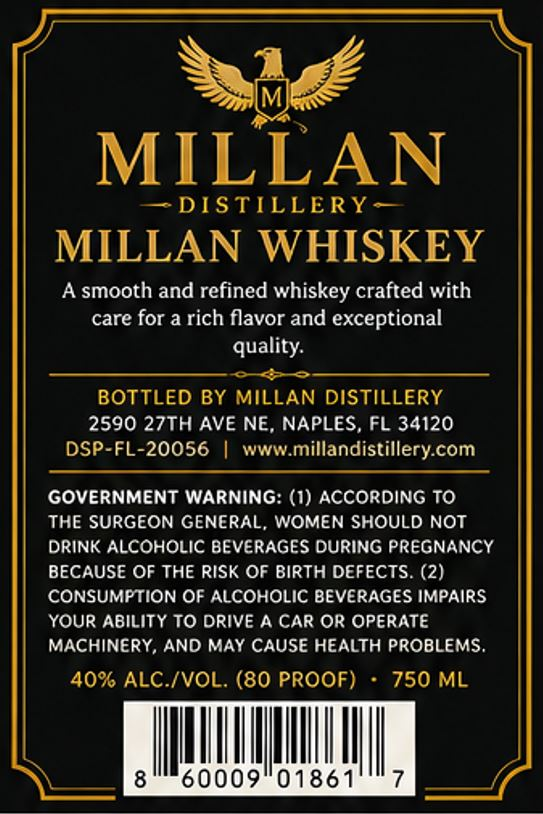
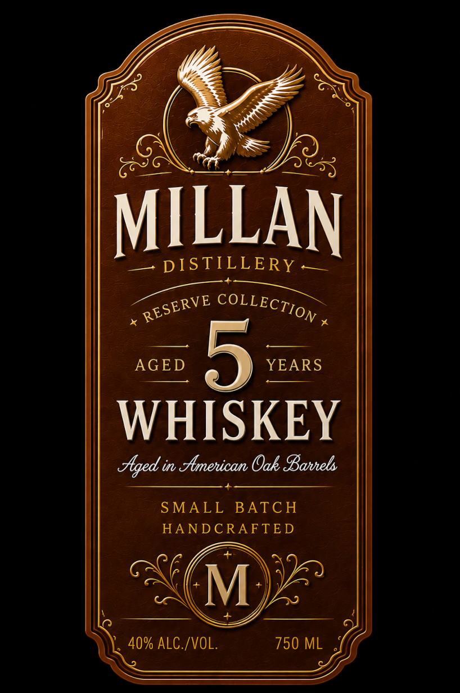

# TTB COLA Label Images - TTBID 26169001000168

**Brand Name:** MILLAN DISTILLERY

**Issue Date:** 06/29/2026

**Origin Code:** 16

**Product Class/Type:** 140

**Source:** [TTB Public COLA Registry](https://ttbonline.gov/colasonline/viewColaDetails.do?action=publicFormDisplay&ttbid=26169001000168)

## Label Images

### Back Label

### Label 1

## Extracted Label Text

*Text extracted via OCR - may contain errors*

**Detected Proof:** 80

### Back Label

MILLAN
DISTILLERY -
MILLAN WHISKEY
A smooth and refined whiskey crafted with
care for a rich flavor and exceptional
quality:
BOTTLED BY MILLAN DISTILLERY
2590 27TH AVE NE, NAPLES, FL 34120
DSP-FL-20056
wwwmillandistillery com
GOVERNMENT WARNING: (1) ACCORDING To
THE SURGEON GENERAL, WOMEN SHOULD NOT
DRINK ALCOHOLIC BEVERAGES DURING PREGNANCY
BECAUSE OF THE RISK OF BIRTH DEFECTS. (2)
CONSUMPTION OF ALCOHOLIC BEVERAGES IMPAIRS
YouR Ability To Drive A CAR OR Operate
MACHINERY, AND MAY CAUSE HEALTH PROBLEMS
40% ALC /VOL. (80 PROOF)
750 ML
60009"01861

### Label 1

a

P=),

AILLAN

S=- leS LLL ERay

2g eee

pee

(ae

AGED

YEARS

WHISKEY

Aged in American Oak Barrels

SMALL BATCH

HANDCRAFTED

SMe

% ALC./VOL.

ee

ne
