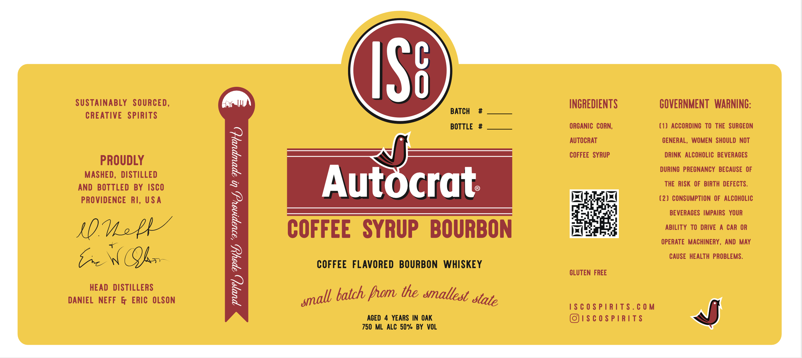

# TTB COLA Label Images - TTBID 26169001000248

**Brand Name:** ISCO

**Fanciful Name:** AUTOCRAT

**Issue Date:** 07/09/2026

**Origin Code:** 40

**Product Class/Type:** 149

**Source:** [TTB Public COLA Registry](https://ttbonline.gov/colasonline/viewColaDetails.do?action=publicFormDisplay&ttbid=26169001000248)

## Label Images

### Label 1

## Extracted Label Text

*Text extracted via OCR - may contain errors*

### Label 1

ISs
SUSTAInABLY SOURCED,
INCREDIENTS
GOVERNMENT  WARNING:
BATCH
CREATIVE   SPIRITS
BOTTLE
ORCANIC CORN,
(1) ACCORDING  TO THE  SURCEON
AUTOCRAT
GENERAL, WOMEN SHOULD NOT
PROUDLY
0
COFFEE   SYRUP
DRInK   ALCOHOLIC BEVERACES
DURING   PRECNANCY  BECAUSE OF
MASHED , DISTILLED
AND   BOTTLED BY ISCO
5
Autocrat
THE  RISK OF
BIRTH  DEFECTS .
PROVIDENCE RI, USA
(2) consUmption OF  AlcOHOLIC
BEVERAGES IMPAIRS   YOUR
ROMzPL
COFFEE   SYRUP
BOURBON
ABILITY
TO  DRIVE
CAR OR
OPERATE   MACHINERY ,
AND MAY
TCQ4 ,
2
CAUSE HEALTH PROBLEMS.
COFFEE
FLAVORED   BOURBON
WHISKEY
CLUTEN FREE
HEAD   DISTILLERS
2
batch fhom the smallest _
DANIEL NEFF &
ERic  OLSON
I$ € 0 $ P |RiTS . € 0 M
ACED
YEARS IN OAK
IS C 0 $ Pirit$
750 ML ALC 50% BY VOL
0
small
state
