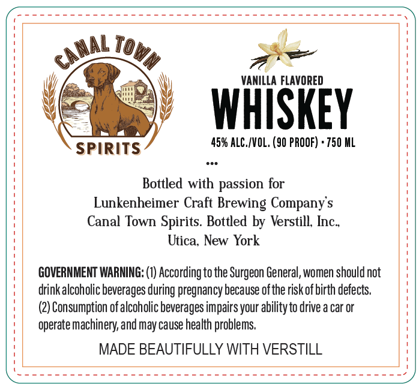
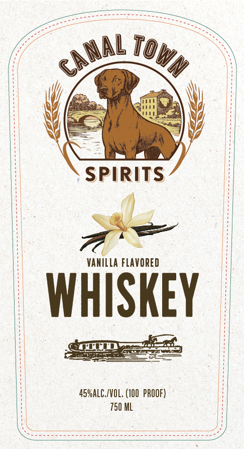

# TTB COLA Label Images - TTBID 26169001000251

**Brand Name:** CANAL TOWN

**Issue Date:** 06/24/2026

**Origin Code:** 02

**Product Class/Type:** 149

**Source:** [TTB Public COLA Registry](https://ttbonline.gov/colasonline/viewColaDetails.do?action=publicFormDisplay&ttbid=26169001000251)

## Label Images

### Back Label

### Front Label

## Extracted Label Text

*Text extracted via OCR - may contain errors*

**Detected Proof:** 90

### Back Label

To
VANILLA FLAVORED
WHISKEY
45% ALC./VOL, (90 PROOF) + 750 HL
SPIRITS
Bottled with passion for
Lunkenheimer Craft Brewing Company s
Canal Town Spirits. Bottled by Verstill Inc_
Utica; New York
GOVERNMENT WARMING: (I) According to the Surgeon General, women should not
drinkalcoholic beverages during pregnancy because ofthe risk of birth defects
(2) Consumption of alcoholic beverages impairs your abilityto drive a car or
operate machinery; and may cause health problems
MADE BEAUTIFULLY WITH VERSTILL
canal
JWn

### Front Label

SPIRITS
VANILLA FLAVORED
WHISKEY
45YAlC/VOL; (100  PROOF)
750 ML
CAnaL
ToWN
