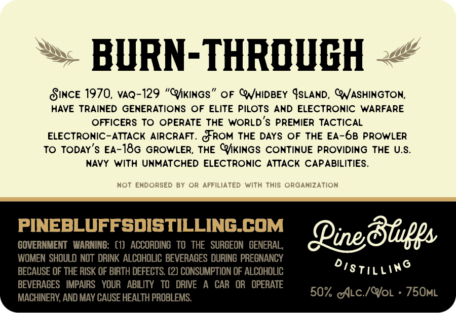
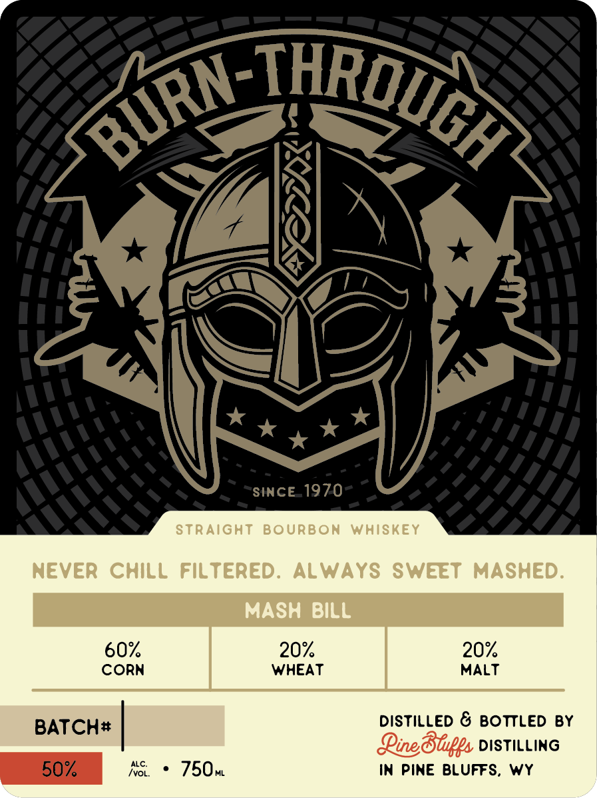

# TTB COLA Label Images - TTBID 26169001000410

**Brand Name:** PINE BLUFFS DISTILLING

**Fanciful Name:** BURN-THROUGH

**Issue Date:** 06/24/2026

**Origin Code:** 49

**Product Class/Type:** 101

**Source:** [TTB Public COLA Registry](https://ttbonline.gov/colasonline/viewColaDetails.do?action=publicFormDisplay&ttbid=26169001000410)

## Label Images

### Back Label

### Front Label

### Label 3

## Extracted Label Text

*Text extracted via OCR - may contain errors*

*1 image(s) excluded: text did not meet readability threshold*

### Back Label

BURN-THROUGH
SiNcE 1970, VAQ-129 "ChKInGs"
OF CNHIDBEY GSLAND, CNASHINGTON;
HAVE TRAINED GENERATIONS OF ELITE PILOTS
AND ELECTRONIC
WARFARE
OFFICERS TO
OPERATE THE WORLD 'S PREMIER TACTICAL
ELECTRONIC-ATTACK
AIRCRAFT. &ROM THE DAYS OF THE EA-68 PROWLER
To TODAY's EA-18G GROWLER, THE CKINGS CONTINUE PROVidiNg THE U.S_
NAVY With UNMATCHED ELECTRONIC
ATTACK CAPABILITIES .
HOT
ENDORSED BY OR AFFILIATED With This ORGANIZATiOn
pINEFIiFFsdisTII ILINGACOM
Jine8fips
WOMEN SHOULD NOT  DRINK  ALCOHOLIC BEVERACES DURING  PREGNANCY
BECAUSE OF THE RISK OF BIRTH DEFECTS. (2) CONSUMPTION OF ALCOHOLIC
DisTIlling
BEVERACES   IMPAIRS   YOUR   ABILITY
TO
DRIVE
CAR   OR   OPERATE
MACHINERY; AND MAY CAUSE HEALTH PROBLEMS.
50% @ALc /QoL
75OML

### Front Label

3rn-THROUGA
SINCE 1970
STRAight
BoURBon
Whiskey
NEVER
CHiLL
Filtered.
ALWAYS SWEET
MASHED:
MASH
BILL
60
20%
20
CORN
WHEAT
MALT
BATCH#
DISTiLLED &
BOTTLED BY
Jinedfupgs DISTILLING
ALC
50
[VOL,
750-
IN PINE BLUFFS,
wy
