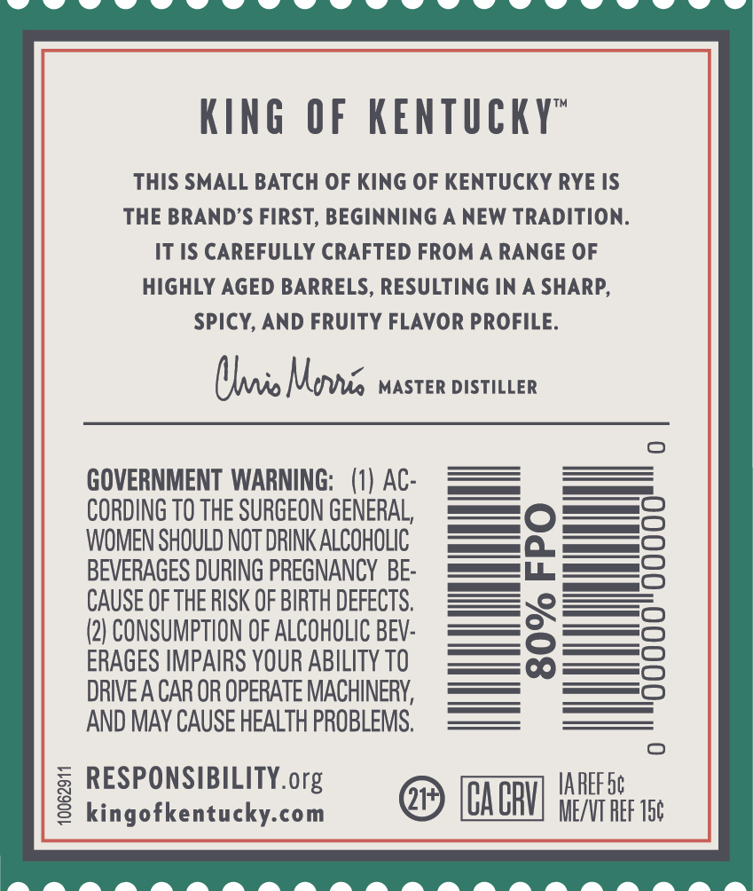
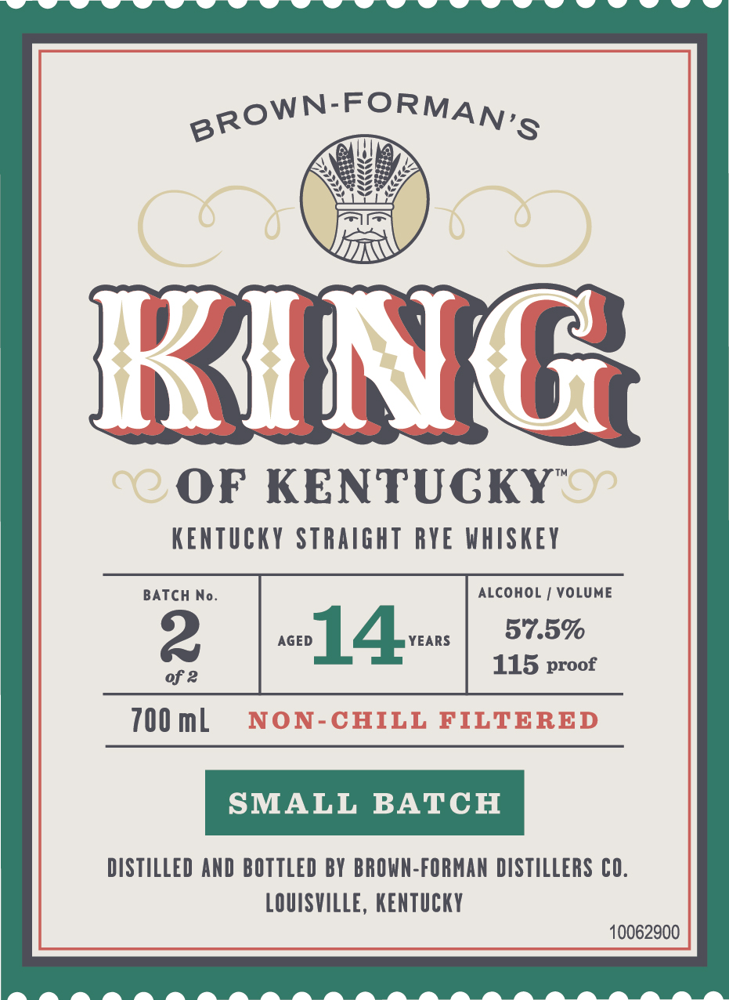

# TTB COLA Label Images - TTBID 26169001000436

**Brand Name:** KING OF KENTUCKY

**Fanciful Name:** SMALL BATCH

**Issue Date:** 06/24/2026

**Origin Code:** 22

**Product Class/Type:** 102

**Source:** [TTB Public COLA Registry](https://ttbonline.gov/colasonline/viewColaDetails.do?action=publicFormDisplay&ttbid=26169001000436)

## Label Images

### Back Label

### Front Label

## Extracted Label Text

*Text extracted via OCR - may contain errors*

**Detected Proof:** 115
**Detected Age:** 14 Years

### Back Label

KIng
OF KEnTUCKY"
THIS SMALL BATCH OF KING OF KENTUCKY RYE IS
THE BRANDS FIRST, BEGINNING
NEW TRADITION:
IT IS CAREFULLY CRAFTED FROM
RANGE OF
HIGHLY AGED BARRELS, RESULTING IN
SHARP,
Spicy, AND FRUIty FLAVOR PROFILE:
(hi Mevuia
MASTER DISTILLER
GOVERNMENT WARNING;   (1) AC:
CORDING TO THE SURGEON GENERAL,
WOMEN SHOULD NOT DRINK ALCOHOLIC
BEVERAGES DURING PREGNANCY BE:
8
CAUSE OF THE RISK OF BIRTH DEFECTS,
1
(2) CONSUMPTION OF ALCOHOLIC BEV:
ERAGES IMPAIRS YOUR ABILITY TO
DRIVE A CAR OR OPERATE MACHINERY,
AND MAY CAUSE HEALTH PROBLEMS;
6 RESPONSnBuckY org
CABbV
IAREF Sc
kingofkentucky-com
ME/VT REF 15c

### Front Label

BROWN-FORMAN'S
RHXG
C@ OF KENTUGKY"S
KENTUCKY StRaight RYE WHISKEV
BATCH
No.
ALCOHOL
VOLUME
2
AGED
14
YEARS
57.5%
115 proof
of ?
700 mL
NON-CHILL FILTERED
SMALL BATCH
DISTILLED AND BOTTLEd BY BROWN-FORMAN DISTILLERS CO.
LOUISVILLE, KenTuCKY
10062900
