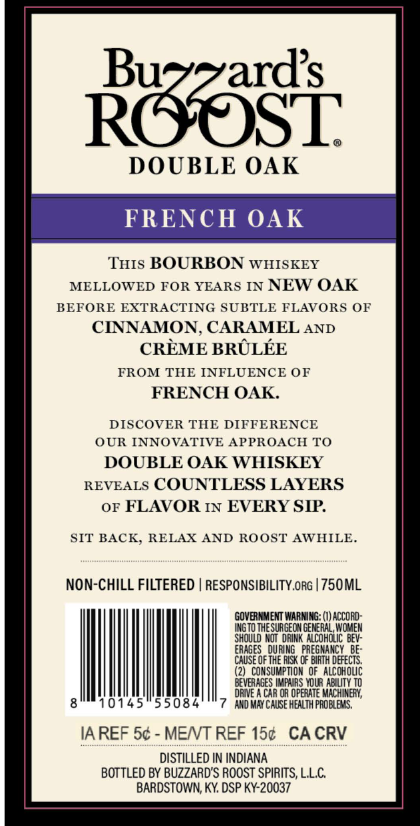

# TTB COLA Label Images - TTBID 26169001000566

**Brand Name:** BUZZARD'S ROOST

**Issue Date:** 06/29/2026

**Origin Code:** 22

**Product Class/Type:** 101

**Source:** [TTB Public COLA Registry](https://ttbonline.gov/colasonline/viewColaDetails.do?action=publicFormDisplay&ttbid=26169001000566)

## Label Images

### Back Label

## Extracted Label Text

*Text extracted via OCR - may contain errors*

### Back Label

Raaasi
DOUBLE OAK
FRENCH OAK
THIs BOURBON
WHISKEY
MELLOWED FOR YEARS IN NEW OAK
BEFORE EXTRACTING SUBTLE FLAVORS OF
CINNAMON, CARAMEL
AND
CREME BRULEE
FROM TIE INFLUENCE OF
FRENCH OAK.
DISCOVER THE DIFFERENCE
OUR INNOVATIVE
APPROACH TO
DOUBLE OAK WHISKEY
REVEALS
COUNTLESS LAYERS
OF
FLAVOR IN EVERY SIP
SIT BACK; RELAX AND ROOST AWHILE
Non-CHilL FILTERED
RESPONSIBILITY.ORG | 750ML
GQVERA MEN WMarNG: ()accoRD;
LGTO ESUR GECM GEMERAL,WQMEM
Should KJt daInk  nicohglIc bev:
EAAGES   QUENG   RREGMANCY  De:
CALSE QF THE RISK CF BIRTH defeCTS,
(21ConsuwpTgm QF alcohoUC
MOUR HBUTV
De31
D
OPERATE
IHERL
0145
5508
AdMNChIGE HEXlT pROELeUS,
IA REF 5c
MENT REF 150   CA CRV
DISTILLED
INDIANA
BOTTLED BY BUZZARDS ROOST SPIRITS, LLC
BARDSTOWN; KY DSP KY-20037
