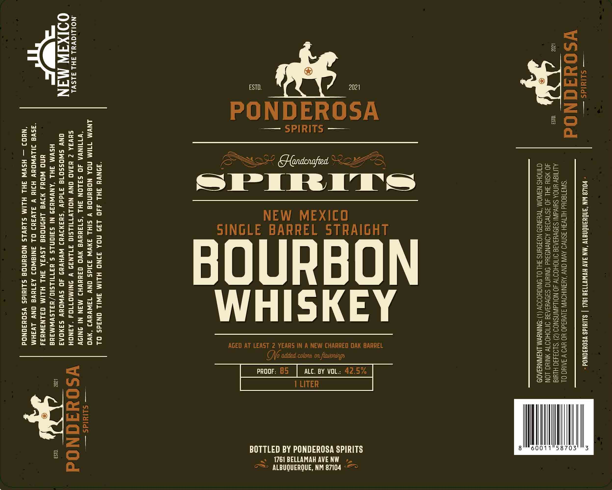

# TTB COLA Label Images - TTBID 26169001000613

**Brand Name:** PONDEROSA SPIRITS

**Fanciful Name:** SINGLE BARREL STRAIGHT BOURBON WHISKEY

**Issue Date:** 06/25/2026

**Origin Code:** 34

**Product Class/Type:** 101

**Source:** [TTB Public COLA Registry](https://ttbonline.gov/colasonline/viewColaDetails.do?action=publicFormDisplay&ttbid=26169001000613)

## Label Images

### Label 1

## Extracted Label Text

*Text extracted via OCR - may contain errors*

### Label 1

3

— Siieids — - PO1L8 WN “ANGUANGNATY “MN AAV HVWW1198 1921 | SLIMIdS YSOUIONOd -

VY =) 0 a c qd N 0 d “SINTT80Ud HITWSH ASN AVIN ONY AYANIHOVW SIVd3d0 YO YV9 V JAIN OL

an an ALMa¥ HNOA SUlvdINI S3DVHIAIS INOHOO 40 NOLLAWNSNOO (2) ‘$193430 HII
40 SIU SHL 40 3S1VO38 AONVND3Hd ONIMNG SIOVHIAIS OMOHOOTY YNIHG LON
CINOHS NAINOM TWHANI9 NOIOYNS FH! OL ONIGUODSY (|) “ONINYWM LNSINNYSA09

ral
(=)
KR
co
in
et
o
(=)
so

———
——
a
—<
eo}

‘ _— =;
= | m) Oo)
Ww a se
_ — Bz o> 7)
||: m/e Ay Bs
| “Ow |: =e
— i = i aa5
ee an ak es
— = S oa =u
= = = 235
= Tas =e me | 2: |. = BS
© bi nu : Gee
z | a “Sg :
= = = =a
a 5 a |F BS
Oo. S :
= 2
0 —o

“SONWH JHL 440 139 NOA FINO HLIM 3WIL ONadS OL
INYM T1IM MOA NOGUNOE V SIHL JNVW 33IdS ONY TaWVuY3 ‘xVvO —_ suuids —
“YTIINWA 40 SALON 3HL ‘S73uHVa VO G3HHVHI MAN NI ONIDV : =

NOILIGVal SHL ALSVL SHVJA Z H3AO ONV NOILYTILSIO 37LN39 V INIMOT104 “A3NOH
OOIXIJW MIN ONY SWOSSO78 31ddv ‘suaNJvd WVHYH9 JO SWWOUuY SaNOAa WSO BE a N Od

. 4 HSWM JHL ‘ANWNU39 NI S3IONLS § HATIILSIO/HaLSVWMaue
uNO WOH NIWa LHONOWE LSWIA JHL HLIM G3LN3WH34
“ASV JILVWNOUY HIIH VW 3LV3H) OL SNISWOJ AZTHVE ONV LVZHM
“NHO3 — HSWW JHL HLIM SLUVLS NOSYNOd SLIWIdS YSOUFONOd

Lee ‘sd
