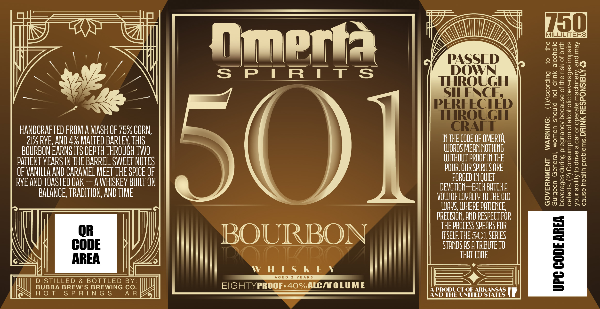

# TTB COLA Label Images - TTBID 26169001000618

**Brand Name:** OMERTA SPIRITS

**Fanciful Name:** 501

**Issue Date:** 06/25/2026

**Origin Code:** 12

**Product Class/Type:** 101

**Source:** [TTB Public COLA Registry](https://ttbonline.gov/colasonline/viewColaDetails.do?action=publicFormDisplay&ttbid=26169001000618)

## Label Images

### Label 1

## Extracted Label Text

*Text extracted via OCR - may contain errors*

### Label 1

fimerta Vem Ul
lal al | acct > \
SPIRITS ae ae PES eee
SILENCE g5o8%5
PERFECTED |S
HANDCRAFTED FROM A MASH OF 75% CORN, 255058
2196 RVE, AND 4% MALTED BARLEY, THIS INTHE CODE OF OMERTA 55s he
BOURBON EARNS ITS DEPTH THROUGH TWO WORDS MEAN NOTHING = BE os
PATIENT YEARS IN THE BARREL. SWEET NOTES TUITE bOESSs
OF VANILLA AND CARAMEL MEET THE SPICE OF FORGED INQIET ggsccs
RYE AND TOASTED OAK — AWHISKEY BUILT ON TITTLE ecocee
BALANCE, TRADITION, AND TIME VOW OF LOVAITY TO THE OLD ae 58
UWOYS, WHERE PATIENCE, goes

PRECISION, AND RESPECT FOR 5

THE PROCESS SPEARS FOR =

|) SQLIRIBON I) |] Sia |

y i ial

Mi MYOTIZ DT) \\ THAT CODE =I

WHISKEY * =

Ae = SS Pr

A PRODUCT + | =

AND THE UNITED STATES Iv
