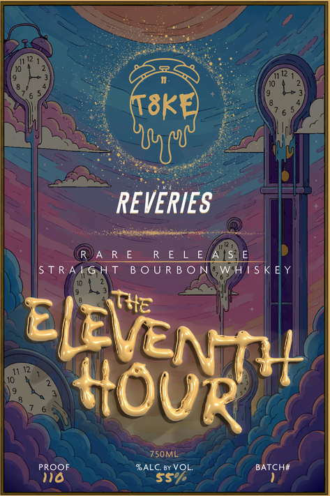
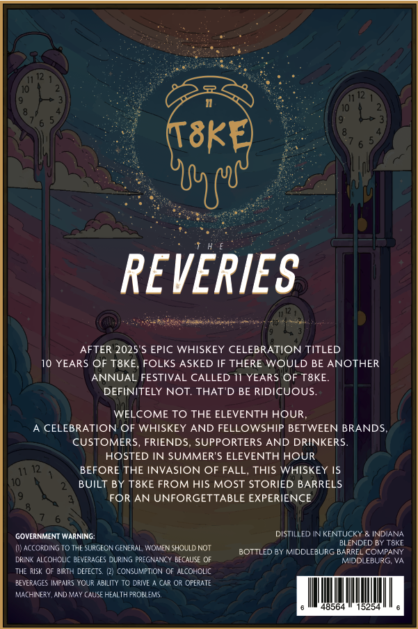

# TTB COLA Label Images - TTBID 26169001000657

**Brand Name:** REVERIES

**Fanciful Name:** THE ELEVENTH HOUR

**Issue Date:** 06/29/2026

**Origin Code:** 05

**Product Class/Type:** 101

**Source:** [TTB Public COLA Registry](https://ttbonline.gov/colasonline/viewColaDetails.do?action=publicFormDisplay&ttbid=26169001000657)

## Label Images

### Back Label

### Label 1

## Extracted Label Text

*Text extracted via OCR - may contain errors*

*1 image(s) excluded: text did not meet readability threshold*

**Detected Age:** 10 Years

### Label 1

T8ke
REVERIES
AFTER 2025'S EPIC WHISKEY CELEBRATION TITLED
10 YEARS OF T8KE, FOLKS ASKED IF THERE WOULD BE ANOTHER
ANNUAL FESTIVAL CALLED I1 YEARS OF T8KE
DEFINITELY NOT THAT 'D BE RIDICUOUS
WELCOME TO THE ELEVENTH HOUR
CELEBRATION OF WHISKEY AND FELLOWSHIP BETWEEN BRAND
CUSTOMERS, FRIENDS
SUPPORTERS
AND DRINKERS
HOSTED IN SUMMER'S ELEVENTH HOUR
BEFORE THE INVASION OF FALL, THIS WHISKEY
BUILT BY T8KE FROM HIS MOST STORIED BARRELS
FOR
AN UNFORGETTABLE EXPERIENCE
GOVERNMENT WARNING:
LISTILLED IN KENTUCKY
INDIANA
BLENDED BY TSKE
AC(CRDING 10 THF SURGECN GENERAL 'OMMEN SHOULD NOT
BOTTLED BY MIDCLEBURG BARREL cCMPANY
DRINK AICOHOL? BEVERAGFS DURING PRECNANCY BFCAUSE OF
MIDDLEBURG VA
TIE RISK OF PIRTH DETICTS
(CNSUMFTION Or ALCOHOLC
BEVERAGES IMPAIRS YOUR ABILITY T0 DRIVE
CAR 03 OPERATE
MAFINFRY  AND YAY CAUSF HFALTHCROBFMS
48564
5254
