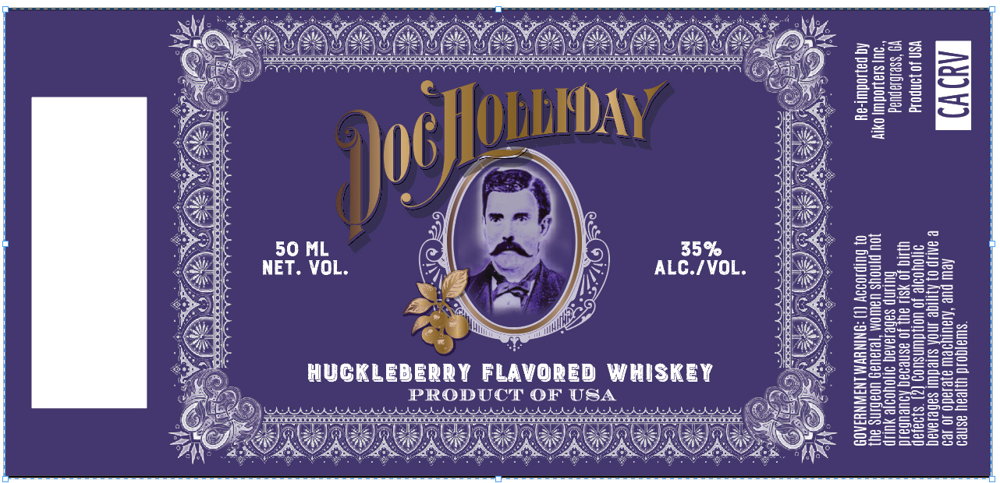

# TTB COLA Label Images - TTBID 26169001000679

**Brand Name:** DOC HOLLIDAY

**Fanciful Name:** HUCKLEBERRY

**Issue Date:** 07/02/2026

**Origin Code:** 00

**Product Class/Type:** 149

**Source:** [TTB Public COLA Registry](https://ttbonline.gov/colasonline/viewColaDetails.do?action=publicFormDisplay&ttbid=26169001000679)

## Label Images

### Front Label

## Extracted Label Text

*Text extracted via OCR - may contain errors*

### Front Label

RC rte re ne ee ee een Pe
| BONO MOM MOM COS 2 <a
: TBR) Sanaa CED Beis Fat
AY Coe e rae Cee SSeS
em “a Sith of Hai
Qe NET. VOL. 7) . ALG./VOL. 22). S3_=252
| h wih ey [) OS) fee
oe 2X O 4 ey azete"
atk are jird 22822225
se HUGKLEBERRY FLAVORED WHISKEY Wee =SS555e=
E>, seeseanunesacmermenncmenensnenees CER ZesE5855
