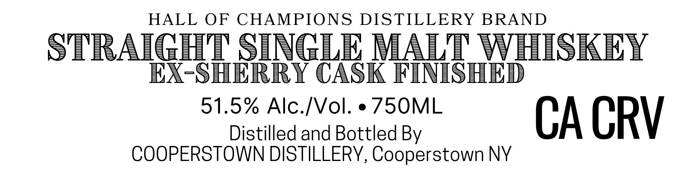
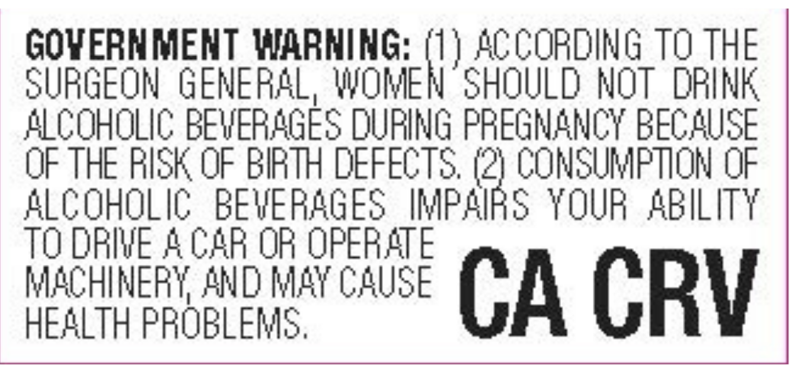

# TTB COLA Label Images - TTBID 26169001000766

**Brand Name:** HALL OF CHAMPIONS

**Fanciful Name:** STRAIGHT SINGLE MALT

**Issue Date:** 06/26/2026

**Origin Code:** 02

**Product Class/Type:** 117

**Source:** [TTB Public COLA Registry](https://ttbonline.gov/colasonline/viewColaDetails.do?action=publicFormDisplay&ttbid=26169001000766)

## Label Images

### Label 1

### Label 2

## Extracted Label Text

*Text extracted via OCR - may contain errors*

**Detected Proof:** 103

### Label 1

HALL OF
CHAMPIONS DISTILLERY BRAND
STRAIGHIT SINGLE MALT WHISKEY
EX-SHERRY CASK FINISHED
51.5% Alc-/Vol:
75OML
Distilled and Bottled By
CA CRV
COOPERSTOWN DISTILLERV, Cooperstown NY

### Label 2

GOVERNMENT WARNING: (1 ) ACCORDING TO THE
SURGEON GENERAL, WOMEN 'SHOULD NOT DRINK
ALCOHOLIC BEWERAGES DURING PREGNANCY BECAUSE
OF THE RISK OF BIRTH DEFECTS (2} CONSUMPTION OF
ALCOHOLIC BEVERAGES
IMPAIRS YOUR   ABILITY
TO DRIVE 4 CAR OR OPERATE
MACHINERY AND MAY CAUSE
CA CRV
HEALTH PROBLEMS,
