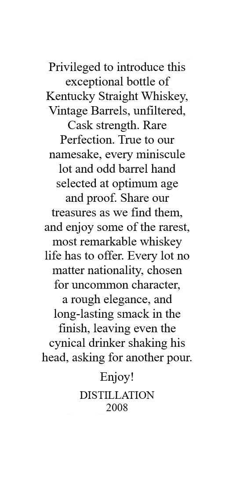
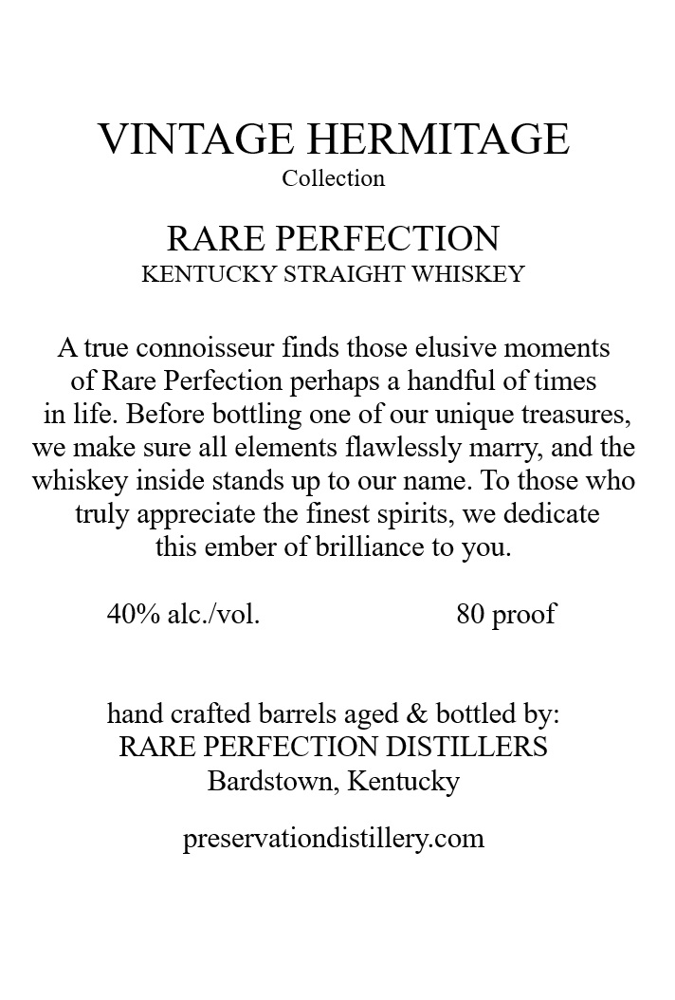
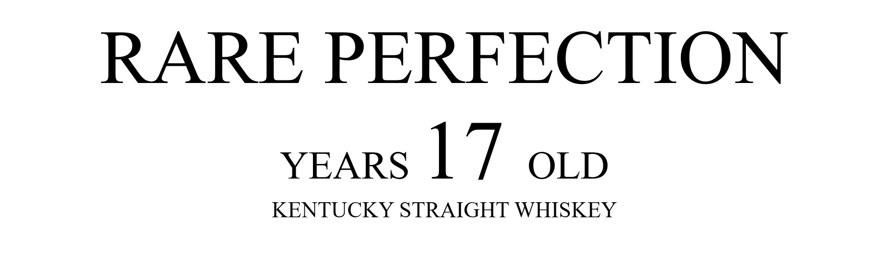

# TTB COLA Label Images - TTBID 26169001000796

**Brand Name:** RARE PERFECTION

**Issue Date:** 06/25/2026

**Origin Code:** 22

**Product Class/Type:** 100

**Source:** [TTB Public COLA Registry](https://ttbonline.gov/colasonline/viewColaDetails.do?action=publicFormDisplay&ttbid=26169001000796)

## Label Images

### Back Label

### Label 1

### Label 2

### Label 4

### Label 5

## Extracted Label Text

*Text extracted via OCR - may contain errors*

**Detected Proof:** 80

### Back Label

Privileged to introduce this
exceptional bottle of
Kentucky Straight Whiskey;
Vintage Barrels, unfiltered,
Cask strength. Rare
Perfection: True to our
namesake, every miniscule
lot and odd barrel hand
selected at optimum age
and proof: Share our
treasures as we find them,
and enjoy some of the rarest;
most remarkable
whiskey
life has to offer: Every lot no
matter
nationality, chosen
for uncommon character;
rough elegance, and
long-lasting smack in the
finish, leaving even the
cynical drinker shaking his
head, asking for another pour:
Enjoyl
DISTILLATION
2008

### Label 1

VINTAGE HERMITAGE
Collection
RARE PERFECTION
KENTUCKY STRAIGHT WHISKEY
A true connoisseur finds those elusive moments
of Rare Perfection perhaps a handful of times
in life. Before bottling one of our unique treasures,
we make sure all elements flawlessly marry, and the
whiskey inside stands up to our name. To those who
truly appreciate the finest spirits, we dedicate
this ember of brilliance to you
40% alc Ivol:
80
hand crafted barrels
& bottled by:
RARE PERFECTION DISTILLERS
Bardstown, Kentucky
preservationdistillery.com
proof
aged

### Label 2

RARE PERFECTION
YEARS
17
OLD
KENTUCKY STRAIGHT WHISKEY

### Label 4

Barrel Number:

Private Barrel Pick for:

1234

A.B.C. Wine & Spirits

### Label 5

GOVERNMENT WARNING:
ACCORDING
TO
THE
SURGEON
GENERAL
INGmEr) AGOBD8
NOT
DRINK
AicoHoLic
BEVERAGES
DURiNG
PREGNANCY
BECAUSE
OF
THE
RISK
OF
BIRTH
DEFFECTS
2
CONSUMpTION
OF
Alcohoic
BEVERAGES
IMPAIRS
YOUR
ABILITY
TO
DRIVE
A
CAR
OR
OPERATE
MACHINERY
And
MAY
CAUSE
UPC - FOR POSITION ONLY
HeALTH
PROBLEMS:
750ml
