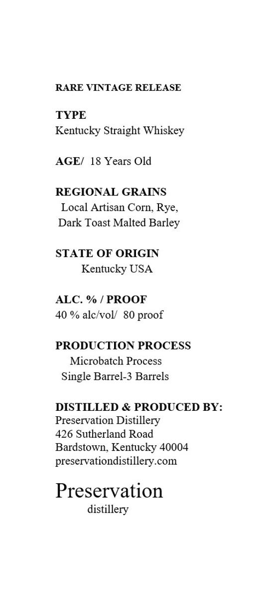
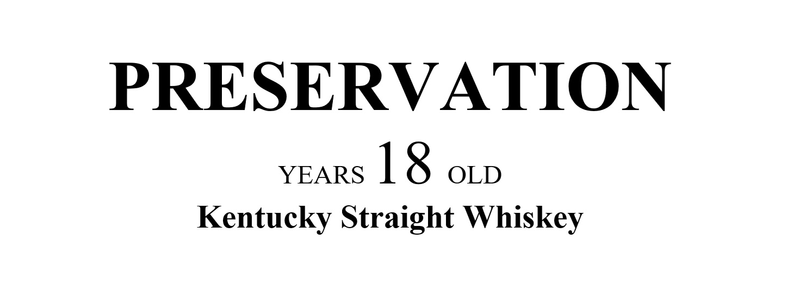
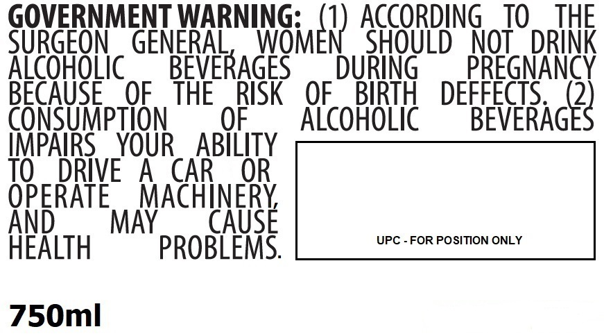

# TTB COLA Label Images - TTBID 26169001000803

**Brand Name:** PRESERVATION

**Issue Date:** 06/25/2026

**Origin Code:** 22

**Product Class/Type:** 100

**Source:** [TTB Public COLA Registry](https://ttbonline.gov/colasonline/viewColaDetails.do?action=publicFormDisplay&ttbid=26169001000803)

## Label Images

### Label 1

### Label 2

### Label 3

### Label 4

## Extracted Label Text

*Text extracted via OCR - may contain errors*

**Detected Proof:** 80
**Detected Age:** 18 Years

### Label 1

RARE VINTAGE RELEASE
TYPE
Kentucky Straight Whiskey
AGEI
18 Years Old
REGIONAL GRAINS
Local Artisan Corn, Rye,
Dark Toast Malted Barley
STATE OF ORIGIN
Kentucky USA
ALC. %
PROOF
40 % alc/voll
80
PRODUCTION PROCESS
Microbatch Process
Single Barrel-3 Barrels
DISTILLED & PRODUCED BY:
Preservation Distillery
426 Sutherland Road
Bardstown, Kentucky 40004
preservationdistillery com
Preservation
distillery
proof

### Label 2

PRESERVATION

YEARS 18 OLD
Kentucky Straight Whiskey

### Label 3

Barrel Number:

Private Barrel Pick for:

1234

A.B.C. Wine & Spirits

### Label 4

GOVERNMENT WARNING:
ACCORDING
TO
THE
SURGEON
GENERAL
INGmEr) AGOBD8
NOT
DRINK
AicoHoLic
BEVERAGES
DURiNG
PREGNANCY
BECAUSE
OF
THE
RISK
OF
BIRTH
DEFFECTS
2
CONSUMpTION
OF
Alcohoic
BEVERAGES
IMPAIRS
YOUR
ABILITY
TO
DRIVE
A
CAR
OR
OPERATE
MACHINERY
And
MAY
CAUSE
UPC - FOR POSITION ONLY
HeALTH
PROBLEMS:
750ml
