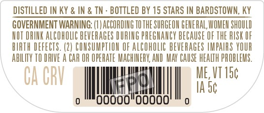
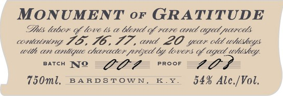
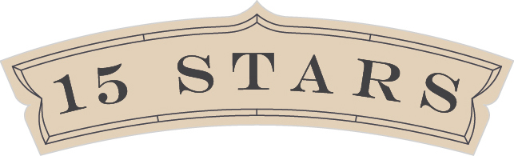
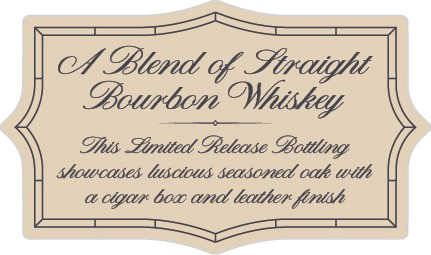

# TTB COLA Label Images - TTBID 26170001000308

**Brand Name:** 15 STARS

**Issue Date:** 06/26/2026

**Origin Code:** 22

**Product Class/Type:** 121

**Source:** [TTB Public COLA Registry](https://ttbonline.gov/colasonline/viewColaDetails.do?action=publicFormDisplay&ttbid=26170001000308)

## Label Images

### Back Label

### Front Label

### Label 2

### Label 3

## Extracted Label Text

*Text extracted via OCR - may contain errors*

*1 image(s) excluded: text did not meet readability threshold*

### Back Label

DISTILLED IN KY & IN & TN - BOTTLED BY 15 STARS IN BARDSTOWN, KY
GOVERNMENT WARNING: (1) ACCORDING TO THE SURGEON GENERAL WOMEN SHOULD
NOT DRINK ALCOMOLIC BEVERAGES DURING PREGNANCY BECAUSE OF THE RISK OF
BIATH DEFECTS. (2) CONSUMPTION OF ALCOHOLIC BEVERAGES IMPAIRS YOUR
ABILITY T0 Lip : CAR OR OPERATE MACHINERY, AND MAY CAUSE HEALTH PROBLEMS.

Che '
CA GRY ill i

### Front Label

MONUMENT or GRATITUDE

Dhis labor of lave ts a teri of rare and aged parce

containing JO, F6, 777, and 2O year cle whiskeys

with an antique character prized by lovers of aged uhishey.

BATCH WTO

GO?

PROOF

ee

750ml, BARDSTOWN, KY.

54% Ale./Vol.

### Label 3

0/ _
IBlend of Shraight
9Bourbon
Ihts Fimtted ORetease
Moucases lusctous seasoned oak ulth
cigax bo1 and leathen fintsh
OWhiskey
GBottling
