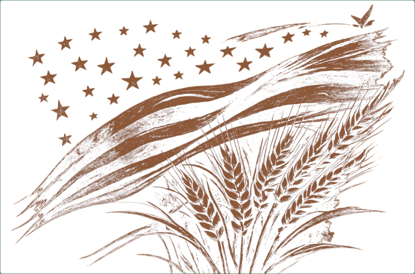
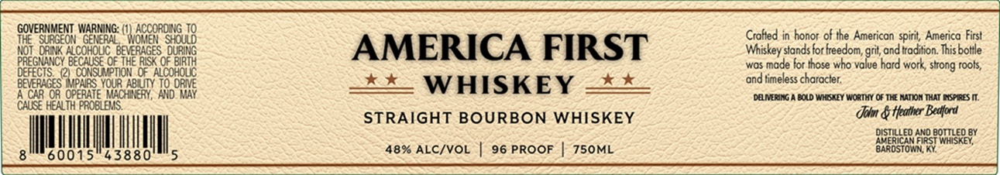

# TTB COLA Label Images - TTBID 26170001000382

**Brand Name:** AMERICAN FIRST WHISKEY

**Issue Date:** 06/25/2026

**Origin Code:** 22

**Product Class/Type:** 101

**Source:** [TTB Public COLA Registry](https://ttbonline.gov/colasonline/viewColaDetails.do?action=publicFormDisplay&ttbid=26170001000382)

## Label Images

### Back Label

### Label 1

### Label 3

## Extracted Label Text

*Text extracted via OCR - may contain errors*

*2 image(s) excluded: text did not meet readability threshold*

**Detected Proof:** 96

### Label 1

GoverMment Waaxhe:
4ocerr943U8
Cralted in honor of the American spirit, America
ES5,
WOI
EecoouoEDeeG5s0
dURING
AMERICA FIRST
Wiskey stands for freedom; grit; and tradifion This bollle
RIS
785
wos made lor those who value hard work strong rools,
BeFeCHGEs
NRNSToTO
T0 ORNE
WHISKEY
ond fimeless character
Cir Or OPERAIE
"oera e
AND
DAMEI E
BOlD WiOKEy Worih Of IkE Mion MHAI ESPRES I
CHUSE HEALTH FROBLEMS
dul & tfather Bedford
STRAIGHT BOURBON WHISKEY
ASErceR eDE
BOMLEO
QTHEO By
48% ALC/VOL
96 PROOF
750ML
BaroTOTMKL
60015"43880
First
