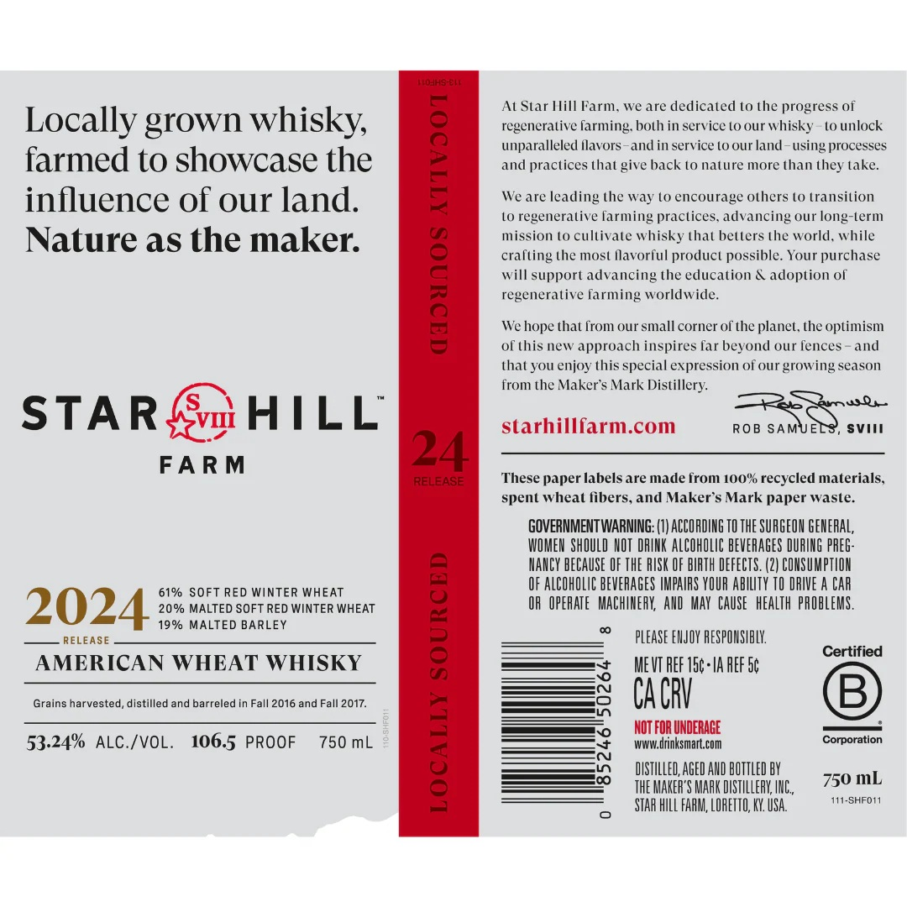
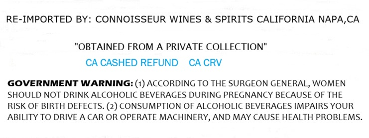

# TTB COLA Label Images - TTBID 26170001000433

**Brand Name:** STAR HILL FARM

**Issue Date:** 07/27/2026

**Origin Code:** 00

**Product Class/Type:** 140

**Source:** [TTB Public COLA Registry](https://ttbonline.gov/colasonline/viewColaDetails.do?action=publicFormDisplay&ttbid=26170001000433)

## Label Images

### Label 1

### Label 2

## Extracted Label Text

*Text extracted via OCR - may contain errors*

**Detected Proof:** 122

### Label 1

LOJhS-C|.
At Star Hill Farm
we are dedicated t0 the progress of
Locally grown whisky;
regcneralive
farming: both in service to our whisky
t0 unlock
unparalleled Ilavors
and in service (0 our land
using processes
farmed t0 showcase the
1
and practices that give hack L0 nature more than
take:
influence of our land.
We are
leading the way (0 encourage Olhers (0 transition
Lo regenerative farming praclices. advancing our long-term
Nature as the maker:
mission (0 Cultivale whisky thal belters the world. while
crafting the most flavorful product possible Your purchase
will support advancing the education & adoption of
1
regenerative farming worldwide:
We hope that from our small corner Of the planet, the optimism
ol this new approach inspires far beyond our fences
and
that you enjoy this special expression of our growing season
from the Maker s Mark Distillery:
8p
87USDU
STAR
HILL
starhillfarm.com
ROB SAMUELS
SVII
FA RM
24
RRELEASE
These paper labels are made from 100% recycled materials,
spent wheat
fibers, and Maker s Mark paper waste:
GOVERNMENT WARNING:
ACCORDING TO THE SURGEON GEHERAL,
WOMEN ShOULD NOT  RINK ALCOHOLIC BEVERAGES DURING PREG
HANCY BECAUSE OF THE RISK OF BIRTH DEFECTS. (2| COHSUMPTIOH
OF ALCOHOLIC BEVERAGES IMPAIRS YOUR abiLTY TO DRIVE a CAR
61%
SOFT RED WiNTER WHEAT
2024
20 % MALTED SOFT RED WINTER WHEAT
OF   OPERATE   MAChIHERK;  AHD May  CAUSe   heaLth  pROBLEMS .
RELEASE
19% MALTED BARLEY
1
PLEASE ENJOY RESPOHSHBLY
Certified
AMERICAN WHEAT WHISKY
ME VT REF 15c-IA AEF Sc
Grains harvested, distilled and barreled in Fall 2016 and Fall 2017.
Ca CRV
B
NOT FOR UNDERAGE
53.24%
ALC /VOL_
106.5 PROOF
750 mL
WWW dinksmart.com
Corporation
1
DISTILLED; AGED AND BOTTLED BY
750 mL
thE MAKEF'S MAAK DISTILLERK; IHG,
STAR HILL FAAM; LORETTO, KY USA
111-SHFOI1
they

### Label 2

RE-IMPORTED BY: CONNOISSEUR WINES & SPIRITS CALIFORNIA NAPA,CA

"OBTAINED FROM A PRIVATE COLLECTION"

CACASHED REFUND CACRV

GOVERNMENT WARNING: (1) ACCORDING TO THE SURGEON GENERAL, WOMEN

SHOULD NOT DRINK ALCOHOLIC BEVERAGES DURING PREGNANCY BECAUSE OF THE

RISK OF BIRTH DEFECTS. (2) CONSUMPTION OF ALCOHOLIC BEVERAGES IMPAIRS YOUR

ABILITY TO DRIVE A CAR OR OPERATE MACHINERY, AND MAY CAUSE HEALTH PROBLEMS.
