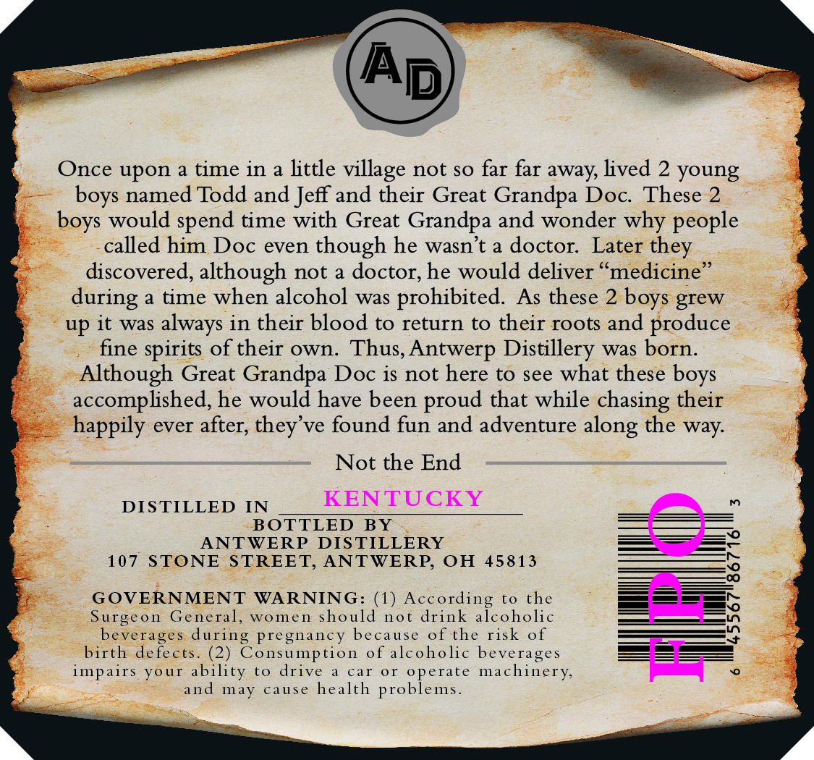
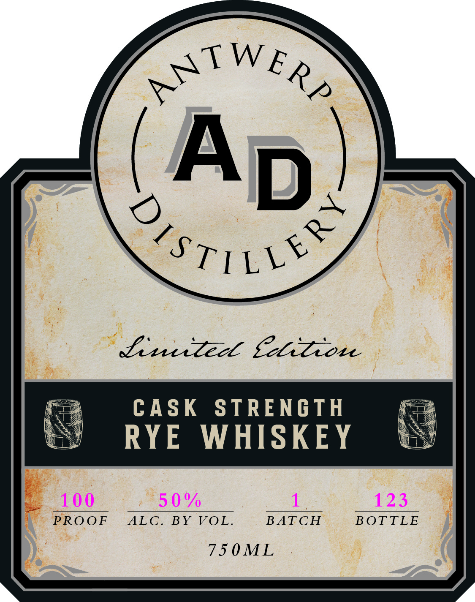

# TTB COLA Label Images - TTBID 26170001000457

**Brand Name:** LIMITED EDITION CASK STRENGTH RYE WHISKEY

**Issue Date:** 06/26/2026

**Origin Code:** 09

**Product Class/Type:** 142

**Source:** [TTB Public COLA Registry](https://ttbonline.gov/colasonline/viewColaDetails.do?action=publicFormDisplay&ttbid=26170001000457)

## Label Images

### Back Label

### Front Label

## Extracted Label Text

*Text extracted via OCR - may contain errors*

### Back Label

Once upon a time in
little
not so far far away; lived 2 young
named Todd and Jeff and their Great Grandpa Doc  These 2
would spend time with Great Grandpa and wonder why
called him Doc even though he wasn't a doctor:
Later they
discovered, although not
a doctor; he would deliver
'medicine
a time when alcohol
was
prohibited
As these 2
grew
up it
was
in their blood to return
to their roots and
produce
fine spirits of their own
Thus, Antwerp Distillery
was born_
Although Great Grandpa Doc is not here to see what these
accomplished he would have been
that while chasing their
happily ever after;
ve found fun and adventure along the way:
Not the End
DISTILLED
IN
KENTUCKY
BOTTLED
BY
ANTWERP
DIS TILLERY
107
STONE
STREET; ANTWERP, OH
45813
SOERNMENT
WA NINGid !o^
Aaidi"kSkohc
the

beverages
during pregnancy
because
of the risk
of
birth defects
(2)
Consumption
of alcoholic beverages
impairs Your ability
to
drive
car
0r
operate machinery,
and
may
cause
health problems
village
boys
boys
people
during
boys
always
boys
proud
they'

### Front Label

CASK STRENGTH
RYE WHISKEY

PROOF ALC. BY VOL. BATCH BOTTLE

7IOML
