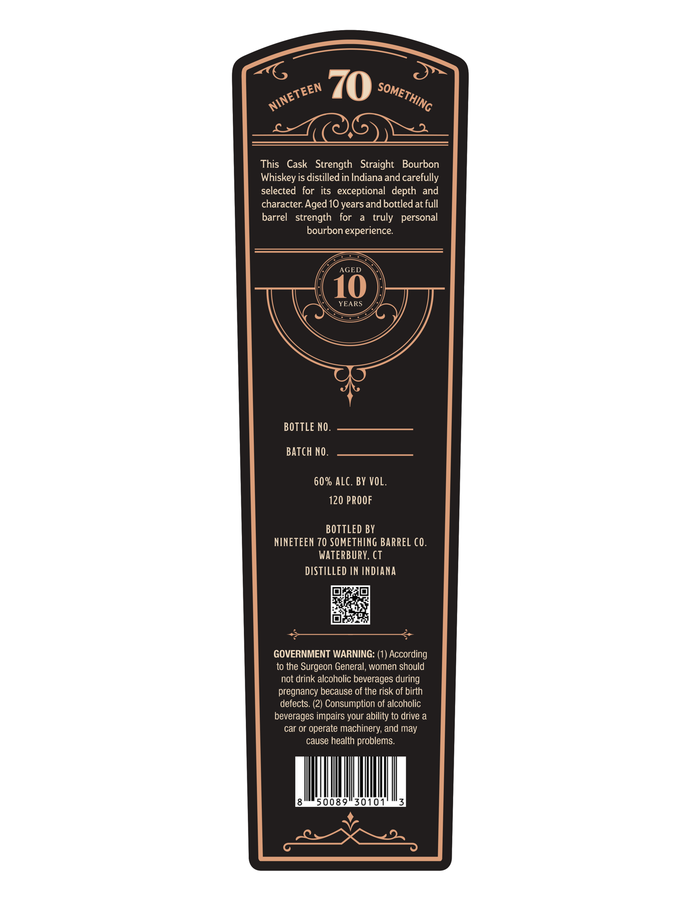
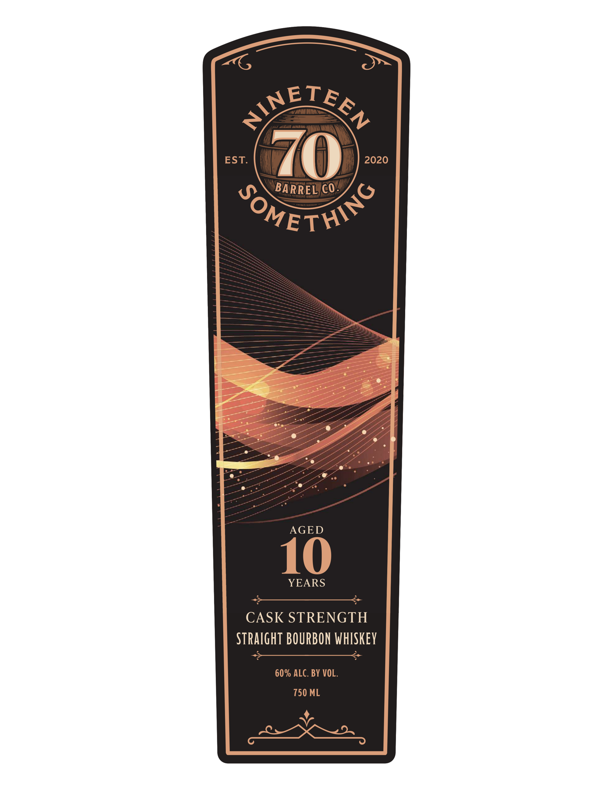

# TTB COLA Label Images - TTBID 26170001000482

**Brand Name:** NINETEEN 70 SOMETHING

**Issue Date:** 07/15/2026

**Origin Code:** 14

**Product Class/Type:** 121

**Source:** [TTB Public COLA Registry](https://ttbonline.gov/colasonline/viewColaDetails.do?action=publicFormDisplay&ttbid=26170001000482)

## Label Images

### Back Label

### Front Label

## Extracted Label Text

*Text extracted via OCR - may contain errors*

**Detected Proof:** 120
**Detected Age:** 10 Years

### Back Label

70
This
Cask   Strength   Straight
Bourbon
Whiskey is distilled in Indiana and carefully
selected  for its   exceptional  depth
and
character Aged 10 years and bottled at full
barrel
strength
for
truly
personal
bourbon experience:
AGED
10
YEARS
BOTTLE NO.
Batch NO .
60% ALC. BY VOL,
120 PROOF
BOTTLED BY
NINETEEN 70 SOMETHING BARREL (0.
WATERBURY, CT
DISTILLED IN INDIANA
GOVERNMENT WARNING: (1) According
to the Surgeon General;, women should
not drink alcoholic beverages during
pregnancy because of the risk of birth
defects. (2) Consumption of alcoholic
beverages impairs your ability to drive a
car or operate machinery; and may
cause health problems.
5 0089
3010
SOMETHING
NINETEEN

### Front Label

~ETEL
EST
2020
BARREL CO=
"OMETHOO
AGED
10
YEARS
CASK STRENGTH
StraIghT BOURBON WhISKEY
60% ALC. BY VOL_
750 ML
