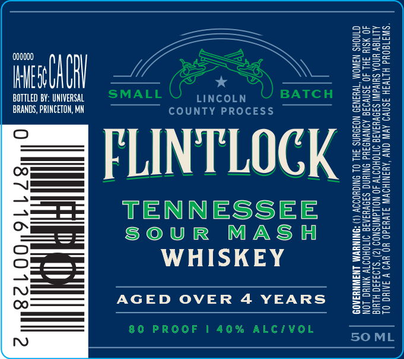

# TTB COLA Label Images - TTBID 26170001000543

**Brand Name:** FLINTLOCK

**Issue Date:** 06/25/2026

**Origin Code:** 43

**Product Class/Type:** 140

**Source:** [TTB Public COLA Registry](https://ttbonline.gov/colasonline/viewColaDetails.do?action=publicFormDisplay&ttbid=26170001000543)

## Label Images

### Label 1

## Extracted Label Text

*Text extracted via OCR - may contain errors*

**Detected Proof:** 80
**Detected Age:** 4 Years

### Label 1

000000

Lue

CARI

BOTTLED BY: UNIVERSAL

SMALL | Rincon

) BATCH

BRANDS, PRINCETON, MN

COUNTY PROCESS

FLINTLOCK

=

TENNESSEE

“—=5

SOUR MASH

—=

WHISKEY

——

AGED OVER 4 YEARS

80 PROOF 1 40% ALC/VOL

50 ML
