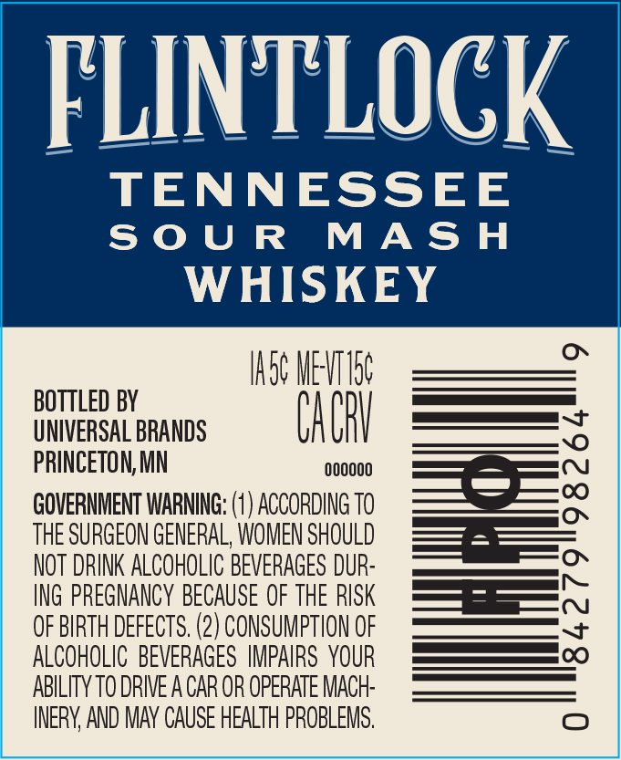
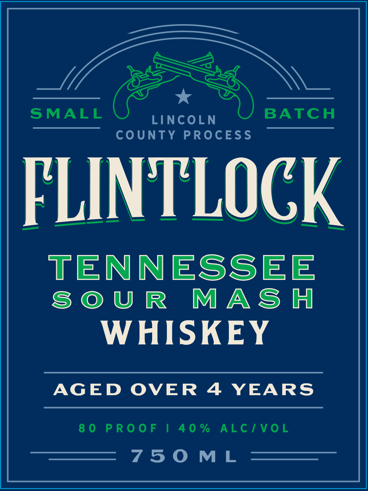

# TTB COLA Label Images - TTBID 26170001000549

**Brand Name:** FLINTLOCK

**Issue Date:** 06/25/2026

**Origin Code:** 27

**Product Class/Type:** 140

**Source:** [TTB Public COLA Registry](https://ttbonline.gov/colasonline/viewColaDetails.do?action=publicFormDisplay&ttbid=26170001000549)

## Label Images

### Back Label

### Label 1

## Extracted Label Text

*Text extracted via OCR - may contain errors*

**Detected Proof:** 80
**Detected Age:** 4 Years

### Back Label

F

== —

Ll

TLO

CK

TENNESSEE

SOUR MASH

WHISKEY

ASG MET Lt

BOTTLED BY

a)

a)

UNIVERSAL BRANDS

u

A

U

i

SSS

PRINCETON, MN

000000

GOVERNMENT WARNING: (1) ACCORDING TO

THE SURGEON GENERAL, WOMEN SHOULD

NOT DRINK ALCOHOLIC BEVERAGES DUR

ING PREGNANCY BECAUSE OF THE RISK

OF BIRTH DEFECTS. (2) CONSUMPTION OF

ALCOHOLIC BEVERAGES IMPAIRS YOUR

ABILITY TO DRIVE A CAR OR OPERATE MACH

INERY, AND MAY CAUSE HEALTH PROBLEMS.

### Label 1

SMALL

LPN

BATCH

COUNTY PROCESS

FLINTLOGK

TENNESSEE

SOUR MASA

WHISKEY

AGED OVER 4 YEARS

80 PROOF | 40% ALC/VOL

7TSOML
