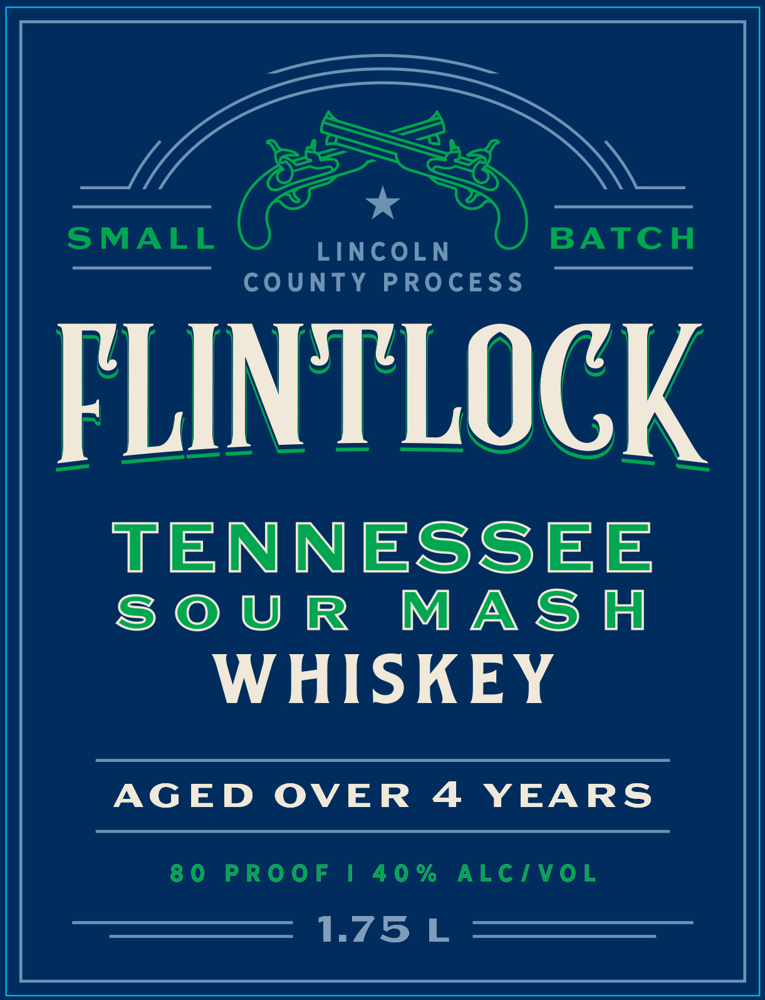
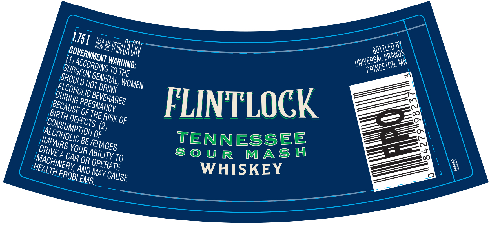

# TTB COLA Label Images - TTBID 26170001000551

**Brand Name:** FLINTLOCK

**Issue Date:** 06/25/2026

**Origin Code:** 43

**Product Class/Type:** 140

**Source:** [TTB Public COLA Registry](https://ttbonline.gov/colasonline/viewColaDetails.do?action=publicFormDisplay&ttbid=26170001000551)

## Label Images

### Label 1

### Label 2

## Extracted Label Text

*Text extracted via OCR - may contain errors*

**Detected Proof:** 80
**Detected Age:** 4 Years

### Label 1

LINCOLN
NTY PROCESS
a)

FLINTLOCK

TENNESSEE
SOUR MASH

WHISKEY

AGED OVER 4 YEARS

80 PROOF | 40% ALC/VOL
L.75L

### Label 2

115]

COVER

ialACHy

Rot

E08

ie

ERSAL

BA

ANOS

\N

SU)

Acta

RDING

ARNING

WN

ANCE

WN,

SHO)

GEO

EM

ERA

,

THE

COW

RINK

WOMEN

bu

RING

C BE

©

BE,

CA

PREGHy

ANCY

VERAGES

FLINTLOCK

Ezz

4

USE Of n

‘

E RisK OF

(2)

Alco

Y TION g

MPa)

BEVE,

TENNESSEE

IVE

RS yo

RAGES

SOUR MASH

CHI

ACA

HEA

LT

NERy

OPERATE

WHISKEY

A A

HLPROp

ae

MAY CAUSE

ca.
