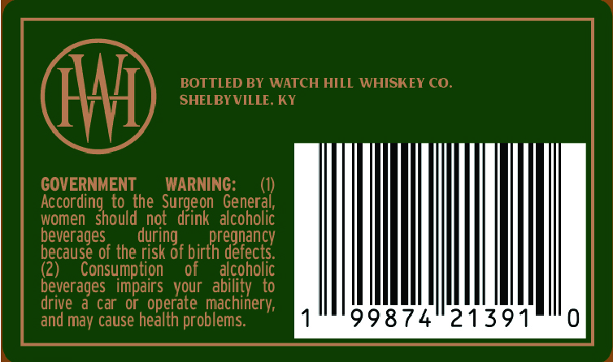
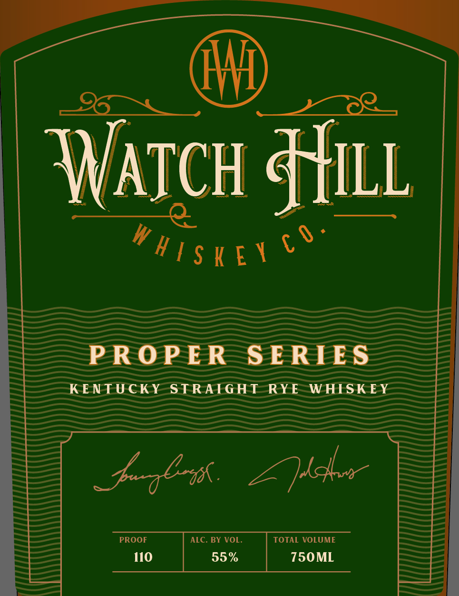

# TTB COLA Label Images - TTBID 26170001000686

**Brand Name:** WATCH HILL WHISKEY CO.

**Fanciful Name:** PROPER SERIES - KY STRAIGHT RYE WHISKEY 110

**Issue Date:** 06/25/2026

**Origin Code:** 22

**Product Class/Type:** 102

**Source:** [TTB Public COLA Registry](https://ttbonline.gov/colasonline/viewColaDetails.do?action=publicFormDisplay&ttbid=26170001000686)

## Label Images

### Back Label

### Label 1

## Extracted Label Text

*Text extracted via OCR - may contain errors*

**Detected Proof:** 110

### Back Label

BOTTLED BY WATCH HILL WHISKEY CO_
SHELBYVILLE. KY
GOVERNMENT
WARNING:
According to the
General;
women   should not
Surgeon
alcoholic
beverages
during
birthreeneccy
because of the risk of
defects
(2)
Consumption
of
alcoholic
beverages   impairs
your   ability
drive
a car Or, operate machinery;
and may cause health problems:
9874
21391

### Label 1

NATCH Hit

Wire

PROPER SERIES

KENTUCKY STRAIGHT RYE WHISKEY

paglh Zehr

PROOF

110

ALC. BY VOL.

55%

750ML
