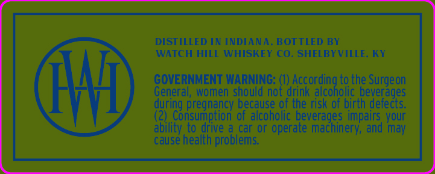
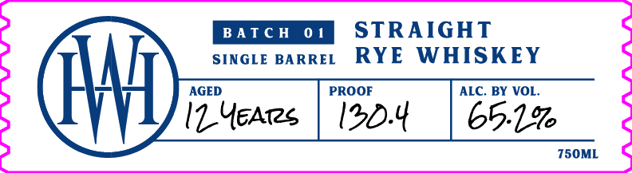

# TTB COLA Label Images - TTBID 26170001000696

**Brand Name:** WATCH HILL WHISKEY CO.

**Fanciful Name:** CHEF'S SERIES

**Issue Date:** 06/26/2026

**Origin Code:** 22

**Product Class/Type:** 102

**Source:** [TTB Public COLA Registry](https://ttbonline.gov/colasonline/viewColaDetails.do?action=publicFormDisplay&ttbid=26170001000696)

## Label Images

### Back Label

### Front Label

### Label 4

## Extracted Label Text

*Text extracted via OCR - may contain errors*

*1 image(s) excluded: text did not meet readability threshold*

### Back Label

DISTILLED IN INDIANA, BOTTLED BY

WATCH HILL WHISKEY CO. SHELBYVILLE. KY

GOVERNMENT WARNING: (1) According to the Surgeon

General, women should not drink alcoholic beverages

during pregnancy because of the risk of birth defects.

2) Consumption of alcoholic beverages impairs your

ability to drive a car or operate machinery, and may

cause health problems.

### Front Label

STRAIGHT
SINGLE BARREL RYE WHISKEY
