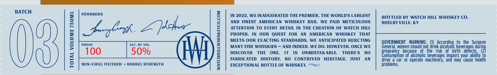
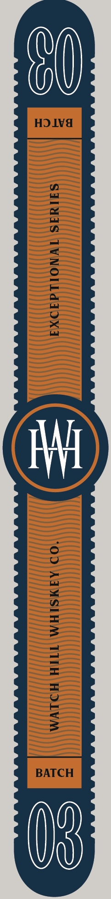

# TTB COLA Label Images - TTBID 26170001000699

**Brand Name:** WATCH HILL WHISKEY CO.

**Fanciful Name:** EXECPTIONAL

**Issue Date:** 06/25/2026

**Origin Code:** 22

**Product Class/Type:** 101

**Source:** [TTB Public COLA Registry](https://ttbonline.gov/colasonline/viewColaDetails.do?action=publicFormDisplay&ttbid=26170001000699)

## Label Images

### Front Label

### Label 3

## Extracted Label Text

*Text extracted via OCR - may contain errors*

*1 image(s) excluded: text did not meet readability threshold*

### Front Label

BATCH

TOTAL VOLUME 750ML

FOUNDERS

Zhe

PROOF ALC. BY VOL.

100 50%

NON-CHILL FILTERED + BARREL STRENGTH

WATCHHILLWHISKEYCO.COM

IN 2022, WE INAUGURATED THE PREMIER, THE WORLD'S LARGEST
AND FINEST AMERICAN WHISKEY BAR. WE PAID METICULOUS
ATTENTION TO EVERY DETAIL IN THE CREATION OF WATCH HILL
PROPER. IN OUR QUEST FOR AN AMERICAN WHISKEY THAT
MEETS OUR EXACTING STANDARDS, WE ANTICIPATED REJECTING
MANY FINE WHISKIES — AND INDEED, WE DO. HOWEVER, ONCE WE
DISCOVER THE ONE, IT IS UNMISTAKABLE. THERE'S NO
FABRICATED HISTORY, NO CONTRIVED HERITAGE, JUST AN
EXCEPTIONAL BOTTLE OF WHISKEY. =~’

BOTTLED BY WATCH HILL WHISKEY CO.
SHELBY VILLE, KY

GOVERNMENT WARNING: (1) According to the Surgeon
General, women should not drink alcoholic pea durin
pear because of the risk of birth defects. @
‘onsumption of alcoholic beverages impairs your ability to
drive a car or operate machinery, and may cause health
problems.
