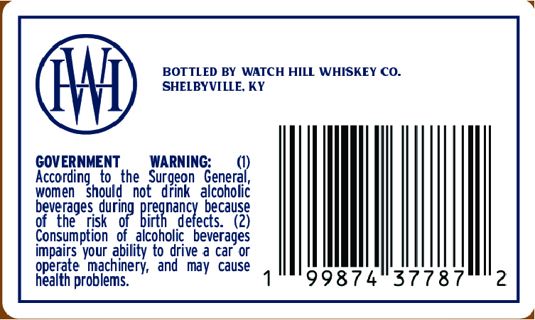
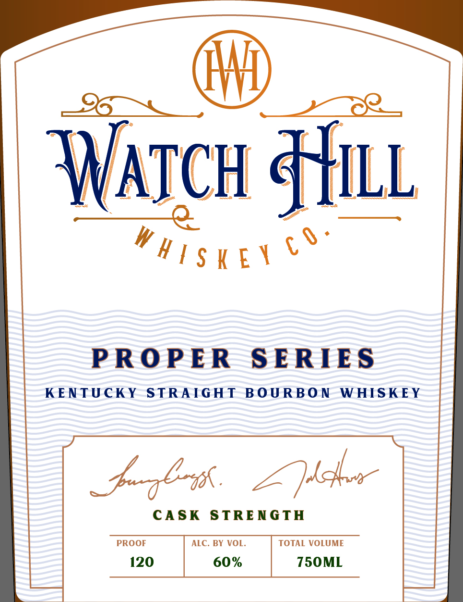

# TTB COLA Label Images - TTBID 26170001000700

**Brand Name:** WATCH HILL WHISKEY CO.

**Fanciful Name:** PROPER SERIES - KENTUCKY STRAIGHT BOURBON WHISKEY

**Issue Date:** 06/25/2026

**Origin Code:** 22

**Product Class/Type:** 101

**Source:** [TTB Public COLA Registry](https://ttbonline.gov/colasonline/viewColaDetails.do?action=publicFormDisplay&ttbid=26170001000700)

## Label Images

### Back Label

### Label 1

## Extracted Label Text

*Text extracted via OCR - may contain errors*

**Detected Proof:** 120

### Back Label

BOTTLED BY WATCH HILL WHISKEY CO.
SHELBYVILLE, KY

GOVERNMENT WARNING: (1

According to the Surgeon eset

women Should not drink alcoholic
beverages durin pre ancy because
of the risk of birth defects. (2)

1 9

Consumption of alcoholic beverages
impairs your ability to drive a car or

operate machinery, and may cause
health problems. a i

9874°37787

### Label 1

oc We

\

y

WATCH Hilt

Wise

PROPER SERIES

KENTUCKY STRAIGHT BOURBON WHISKEY

Medea

CASK STRENGTH

PROOF

120

| 60% | 750ML
