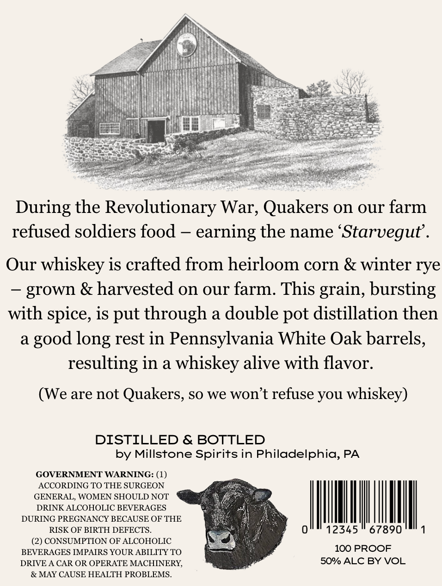
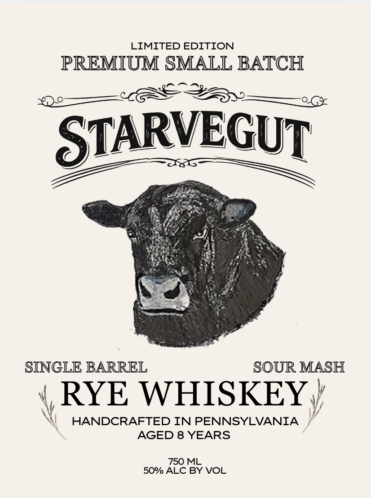

# TTB COLA Label Images - TTBID 26171001000063

**Brand Name:** STARVEGUT

**Issue Date:** 07/06/2026

**Origin Code:** 39

**Product Class/Type:** 142

**Source:** [TTB Public COLA Registry](https://ttbonline.gov/colasonline/viewColaDetails.do?action=publicFormDisplay&ttbid=26171001000063)

## Label Images

### Back Label

### Front Label

## Extracted Label Text

*Text extracted via OCR - may contain errors*

**Detected Proof:** 100
**Detected Age:** 8 Years

### Back Label

During the Revolutionary War, Quakers on our farm
refused soldiers food
earning the name 'Starvegut'_
Our
whiskey is crafted from heirloom corn & winter rye
grown & harvested on our farm: This grain, bursting
with spice, is put through a double pot distillation then
a
long rest in Pennsylvania White Oak barrels,
resulting in a whiskey alive with flavor:
(We are not Quakers, so we won't refuse you
whiskey)
DISTILLED & BOTTLED
by Millstone Spirits in Philadelphia, PA
GOVERNMENT WARNING: (1)
ACCORDING TO THE SURGEON
GENERAL, WOMEN SHOULD NOT
DRINK ALCOHOLIC BEVERAGES
DURING PREGNANCY BECAUSE OF THE
RISK OF BIRTH DEFECTS_
12345
67890
(2) CONSUMPTION OF ALCOHOLIC
BEVERAGES IMPAIRS YOUR ABILITY TO
100 PROOF
DRIVE A CAR OR OPERATE MACHINERY,
50% ALC BY VOL
& MAY CAUSE HEALTH PROBLEMS_
good

### Front Label

LIMITED EDITION
PREMIUM SMALL BATCH
STARVEGUT
SINGLE BARREL
SOUR MASH
RYE WHISKEY
HANDCRAFTED IN PENNSYLVANIA
AGED 8 YEARS
750 ML
50% ALC BY VOL
