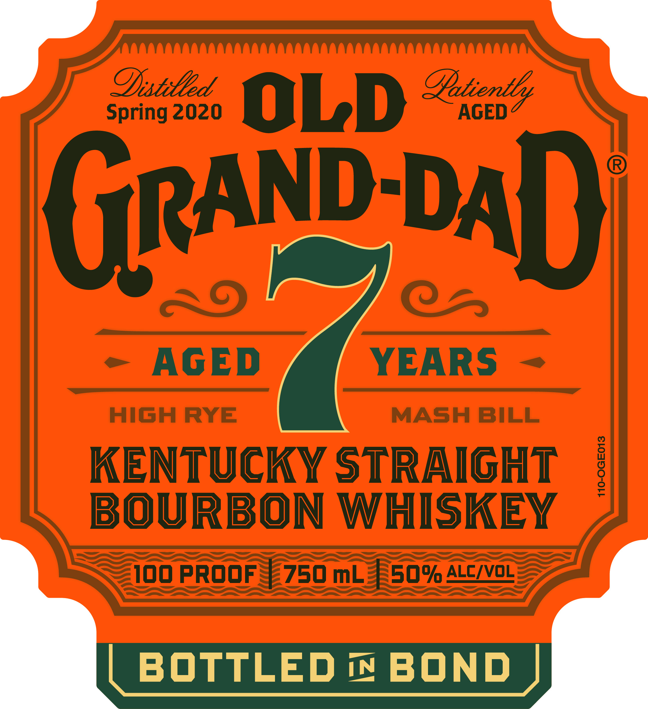
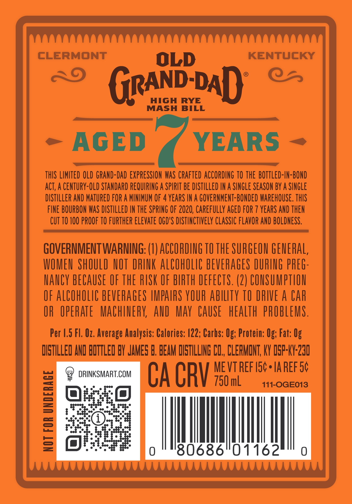

# TTB COLA Label Images - TTBID 26173001000075

**Brand Name:** OLD GRAND-DAD

**Issue Date:** 06/30/2026

**Origin Code:** 22

**Product Class/Type:** 119

**Source:** [TTB Public COLA Registry](https://ttbonline.gov/colasonline/viewColaDetails.do?action=publicFormDisplay&ttbid=26173001000075)

## Label Images

### Label 1

### Label 2

### Label 3

## Extracted Label Text

*Text extracted via OCR - may contain errors*

*1 image(s) excluded: text did not meet readability threshold*

**Detected Proof:** 100
**Detected Age:** 4 Years

### Label 1

spring2620
OLD %usk
AGED
GRAND DAD
6
AGED
YEARS
High
RYE
MASH
BILL
KENTUCKY StRaiGHT
1
BOURBON
WHISKEY
100 proof
750 mL
50% ALC/vOL
BOTTLED
IN
BOND

### Label 3

CLERMONT
OLD
KENTUCKY
GRAND DAD
HIGH
RYE
MASH
BILL
AGED
YEARS
THIS LIMITED OLD GRAND-DAD EXPRESSHON WAS CRAFTEd ACCORDING TO THE  BOTTLed-IN-BOND
ACT, A CENTURY-OLD STANDARD REQUIRING A SPIRIT BE DISTILLED IN A SINGLE SEASON BY A SinGLE
DISTILLER AND MATUREd FOR A MINIMUM OF 4 YEARS IN A GOVERNMENT-BONDED WAREHOUSE. THIS
FINE BOURBON WAS DISTILLED IN THE SPRING OF 2020, Carefully aged FOR
YEARS AND THEN
CUT TO 100 PROOF TO FURTHER ELevAte OGD'S DISTINCTIVELY CLASSIC FLAVOR AND BOLDNESS,
GOVERNMENTWARNING: (I) ACCORDING TO THE SURGEON GENERAL,
WOMEU ShOULD HOT DRINK AlCOhOLIC BEVERAGES DURING PREG-
HauCY BECAUSE OF ThE RISK OF BIRTH DEFECTS. (2) CONSUMPTLON
OF AlCOhOLIC BEVERAGES IMPAIRS YOUR abiLTY TO DRIVE A CAr
OR   OPERATE
Machery;  Aud
May CAUSE
hEalTh  PROBLEMS .
Per 4.5 FL. Oz. Average Analysis: Calories: A22; Carbs: Og; Protein: Og; Fat: Og
DISTILLED AND BOTTLED BY JAMES B, BEAM DIETILLING CD,, CLEFMONT; KY dsp-KY-230
ME VT REF I5c -
IA REF 54
DRINKSMART.COM
CA CRV
750 mL
111-OGE013
1
2
=
'80686"01162
