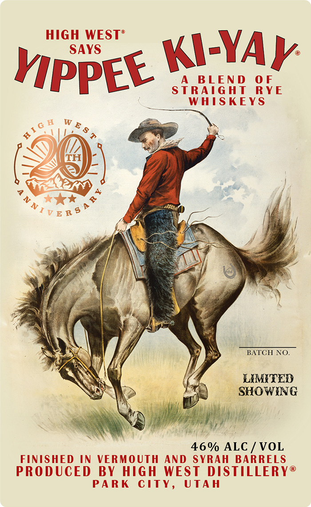
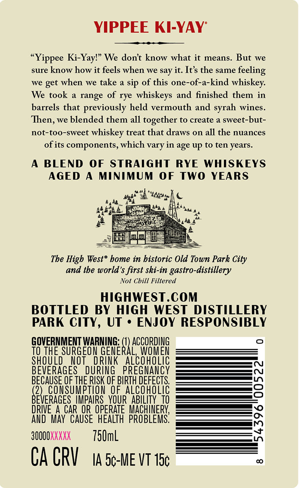

# TTB COLA Label Images - TTBID 26173001000076

**Brand Name:** HIGH WEST

**Fanciful Name:** YIPPEE KI-YAY

**Issue Date:** 06/26/2026

**Origin Code:** 45

**Product Class/Type:** 122

**Source:** [TTB Public COLA Registry](https://ttbonline.gov/colasonline/viewColaDetails.do?action=publicFormDisplay&ttbid=26173001000076)

## Label Images

### Label 1

### Label 2

## Extracted Label Text

*Text extracted via OCR - may contain errors*

**Detected Proof:** 92

### Label 1

hppet Way

BATCH NO.

LAMITED
SHOWING

46% ALC / VOL
FINISHED IN VERMOUTH AND SYRAH BARRELS
PRODUCED BY HIGH WEST DISTILLERY®
PARK CITY, UTAH

### Label 2

YIPPEE KI-YAY
"Yippee Ki-Yayl" We dont know what it means. But we
sure know how it feels when
we
say it. It's the same
we
when
we take a sip of this one-of-a-kind
whiskey:
We took
range of rye
whiskeys and finished them in
barrels that previously held vermouth and
wines.
Then, we blended them all together to create a sweet-but-
not-too-sweet
whiskey treat that draws on all the nuances
ofits components, which vary in age up to ten years
BLEND
OF STRAIGHT
RYE
WHISKEYS
AGED
MINIMUM OF TWO YEARS
The High West? bome in bistoric Old Town Park City
and tbe world's first ski-in gastro-distillery
Not Chill Filtered
HIGHWEST.COM
BOTTLED BY HIGH
WEST DISTILLERY
PARK CITY, UT
ENJOY RESPONSIBLY
GOVERNMENT WARNING:
ACCORDING
TO THE SURGEON GENERAL
WOMEN
shouLd_
NOT
DRINK
AlcohoLIC
BEVERAGES   DURING   PREGNANCY
BECAUSE QF THE RISK OF BIRTH DEFECTS:
8
(2)_CoNSuMPTHON  @e.ALCOHOLIC
BEVERAGES IMPAIRS_YOUR   ABILITY_TO
DRIVE 4 CAR OR OPERATE  MACHINERY,
AND  MAY CAUSE   HEALTH  PROBLEMS,
3OO00XXXXX
750mL
6
CA CRV
IA 5c-ME VT 15c
feeling
get
syrah
