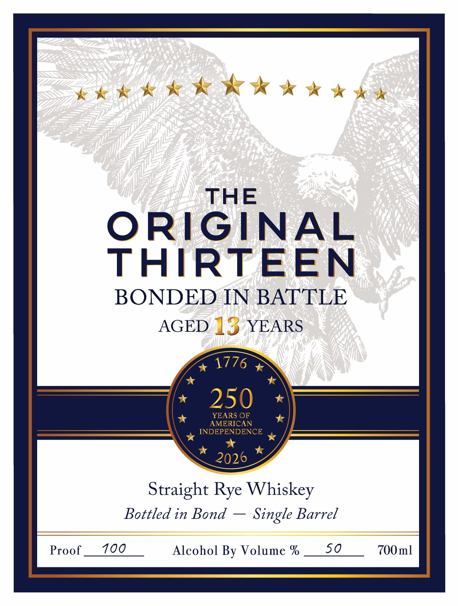
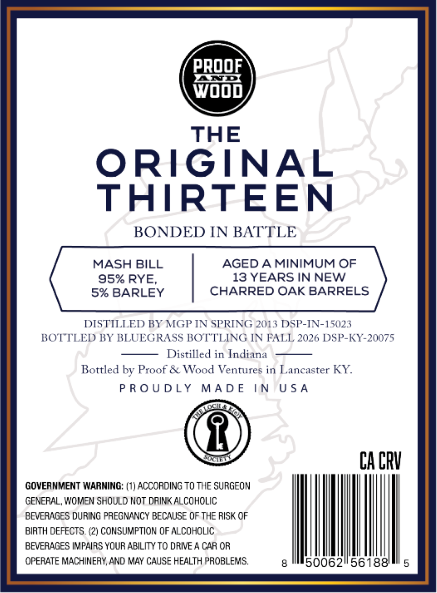

# TTB COLA Label Images - TTBID 26173001000188

**Brand Name:** ORIGINAL THIRTEEN

**Issue Date:** 07/01/2026

**Origin Code:** 22

**Product Class/Type:** 119

**Source:** [TTB Public COLA Registry](https://ttbonline.gov/colasonline/viewColaDetails.do?action=publicFormDisplay&ttbid=26173001000188)

## Label Images

### Front Label

### Label 2

## Extracted Label Text

*Text extracted via OCR - may contain errors*

**Detected Proof:** 100
**Detected Age:** 13 Years

### Front Label

THE
ORIGINAL
THIRTEEN
BONDED IN BATTLE
AGED 13 YEARS
1776
250
YEARS OF
AMERICAN
INDEPENDENCE
2026
Straight Rye Whiskey
Bottled in Bond
Single Barrel
Proof
100
Alcohol By Volume %
50
700ml

### Label 2

PROOF

wooo

THE

ORIGINAL

THIRTEEN

BONDED IN BATTLE

MASH BILL

AGED A MINIMUM OF

95% RYE,

13 YEARS IN NEW

5% BARLEY

CHARRED OAK BARRELS

DISTILLED BY MGP IN SPRING 2013 DSP-IN-15023

BOTTLED BY BLUEGRASS BOTTLING IN FALL 2026 DSP-KY-20075

Distilled in Indiana

Bottled by Proof & Wood Ventures in Lancaster KY.

PROUDLY MADE

IN USA

CA CRY

GOVERNMENT WARNING: (1) ACCORDING TO THE SURGEON

GENERAL, WOMEN SHOULD NOT DRINK ALCOHOLIC

BEVERAGES DURING PREGNANCY BECAUSE OF THE RISK OF

BIRTH DEFECTS. (2) CONSUMPTION OF ALCOHOLIC

BEVERAGES IMPAIRS YOUR ABILITY TO DRIVE A CAR OR

|

OPERATE MACHINERY, AND MAY CAUSE HEALTH PROBLEMS.

8

50062"56188'
