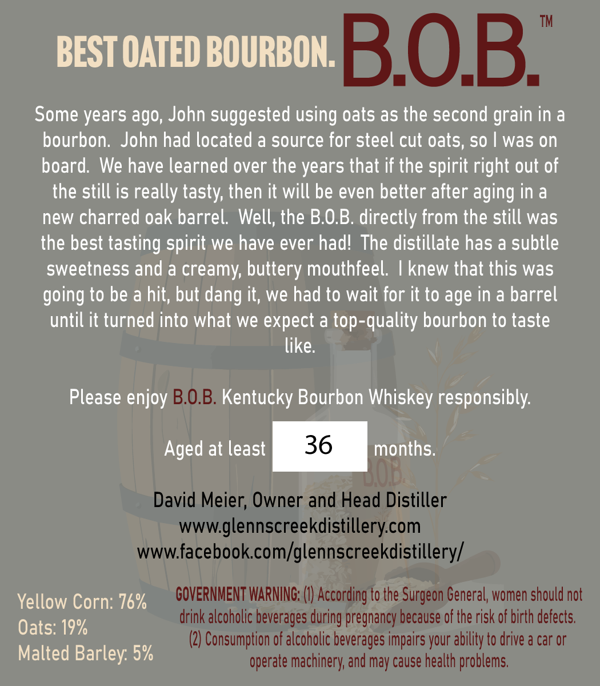
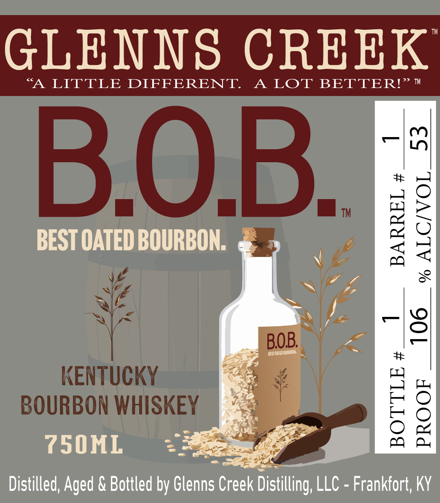

# TTB COLA Label Images - TTBID 26173001000237

**Brand Name:** GLENNS CREEK

**Fanciful Name:** B.O.B.

**Issue Date:** 06/29/2026

**Origin Code:** 22

**Product Class/Type:** 141

**Source:** [TTB Public COLA Registry](https://ttbonline.gov/colasonline/viewColaDetails.do?action=publicFormDisplay&ttbid=26173001000237)

## Label Images

### Back Label

### Front Label

## Extracted Label Text

*Text extracted via OCR - may contain errors*

### Back Label

BEST OATED BOURBON:
BOB
Some years ago; John suggested using oats as the second
in a
bourbon:
John had located a source for steel cut oats, SO
was on
board: We have learned over the years that if the spirit right out of
the still is really tasty; then it will be even better after aging in a
new charred oak barrel  Well; the B.OB. directly from the still was
the best tasting spirit we have ever hadl The distillate has a subtle
sweetness and a
creamy; buttery mouthfeel
knew that this was
going to be a hit; but
it; we had to wait for it to age in a barrel
until it turned into what we expect a top-quality bourbon to taste
like:
Please enjoy B.O.B. Kentucky Bourbon Whiskey responsibly:
Aged at least
36
months:
David Meier; Owner and Head Distiller
wwwglennscreekdistillerycom
WWWL
facebook com/glennscreekdistillery/
Yellow Corn: 76%
GOVERNMENT WARNING: (0) According to the
General; women should not
drink alcoholic beverages during pregnancy because of the risk of birth defects:
Oats: 19%
(2) Consumption of alcoholic beverages impairs your ability to drive a car or
Malted Barley: 5%
operate machinery; and may cause health problems
grain
dang
Surgeon

### Front Label

GLENNS
CREEK
A
LITTLE
DIFFERENT
A LOT BETTER! TM
x1
BOB
#
BEST OATED BOURBON:
TM
1
8
BOB
g
VSTQDbourta
#
KENTUCKY
BOURBON WHISKEY
e
750ML
Distilled; Aged & Bottled by Glenns Creek Distilling; LLC - Frankfort; KY
