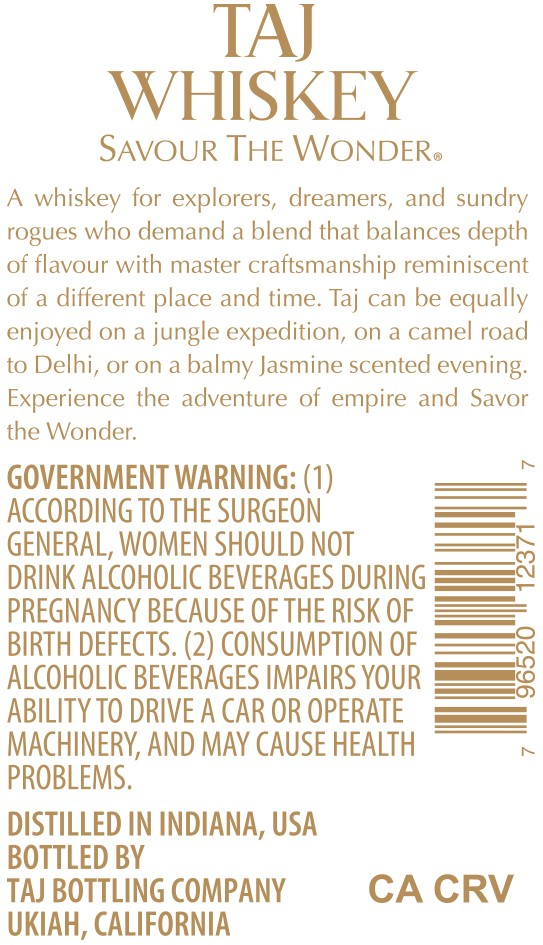

# TTB COLA Label Images - TTBID 26173001000323

**Brand Name:** TAJ

**Issue Date:** 06/26/2026

**Origin Code:** 01

**Product Class/Type:** 139

**Source:** [TTB Public COLA Registry](https://ttbonline.gov/colasonline/viewColaDetails.do?action=publicFormDisplay&ttbid=26173001000323)

## Label Images

### Back Label

### Front Label

## Extracted Label Text

*Text extracted via OCR - may contain errors*

**Detected Proof:** 84

### Back Label

TAJ
WHISKEY
SAVOUR THE WONDERo
whiskey for explorers, dreamers, and
rogues who demand a blend that balances depth
of flavour
master craftsmanship reminiscent
of a different place and time. Taj can be equally
enjoyed on
jungle expedition, on
a camel road
to Delhi, or on
balmy Jasmine scented evening:
Experience the adventure of empire and Savor
the Wonder:
GOVERNMENT WARNING: (1)
ACCORDING TO THE SURGEON
GENERAL, WOMEN SHOULD NOT
DRINK ALCOHOLIC BEVERAGES DURING
PREGNANCY BECAUSE OF THE RISK OF
BIRTH DEFECTS. (2) CONSUMPTION OF
ALCOHOLIC BEVERAGES IMPAIRS YOUR
ABILITY TO DRIVE A CAR OR OPERATE
MACHINERV, AND MAy CAUSE HEALTH
PROBLEMS.
DISTILLED IN INDIANA, USA
BOTTLED BY
TAJ BOTTLING COMPANY
CA CRV
UKIAH, CALIFORNIA
sundry
with

### Front Label

TAJ
WHISKEY
BLENDED MALT WHISKEY
42% ALCNOL
750 ML
