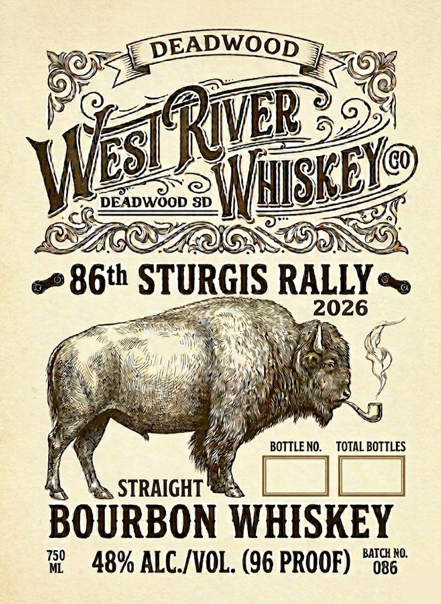

# TTB COLA Label Images - TTBID 26173001000338

**Brand Name:** WEST RIVER WHISKEY

**Issue Date:** 06/26/2026

**Origin Code:** 42

**Product Class/Type:** 101

**Source:** [TTB Public COLA Registry](https://ttbonline.gov/colasonline/viewColaDetails.do?action=publicFormDisplay&ttbid=26173001000338)

## Label Images

### Back Label

### Label 1

## Extracted Label Text

*Text extracted via OCR - may contain errors*

**Detected Proof:** 96

### Back Label

AGED & BOTTLED BY:
BLACKFORK SPIRITS
BRANDT, SD
PrsuA cralta
in
Soni Daksfa
krom |oca] %tains
GOVERNMENT WARNING:
(1) ACCORDING TO THE SURGEON
GENERAL, WOMEN SHOULD NOT
DRINK
ALCOHOLIC BEVERAGES
DURING PREGNANCY BECAUSE OF
THE RISK OF BIRTH DEFECTS: (2)
CONSUMPTION OF
ALCOHOLIC
BEVERAGES IMPAIRS YOUR ABILITY
TO DRIVE
A
CAR OR OPERATE
MACHINERY
AND MAY CAUSE
HEALTH PROBLEMS.
DISTILLED IN WISCONSIN:
WWW.WESTRIVERWHISKEYCO.COM

### Label 1

DEADWOOD
DEADLOOD 8D
86th STURGIS RALLY
2026
BOTTLE NO:
TOTAL BOTTLES
STRAIGHT
BOURBON WHISKEY
750
BATCH NO.
48% ALC /VOL. (96 PROOF)
086
WEsiRwb
WSEEV@
