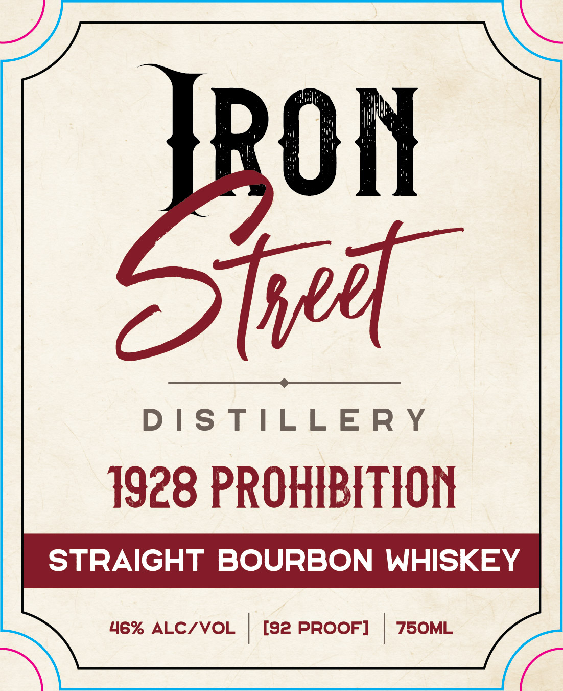
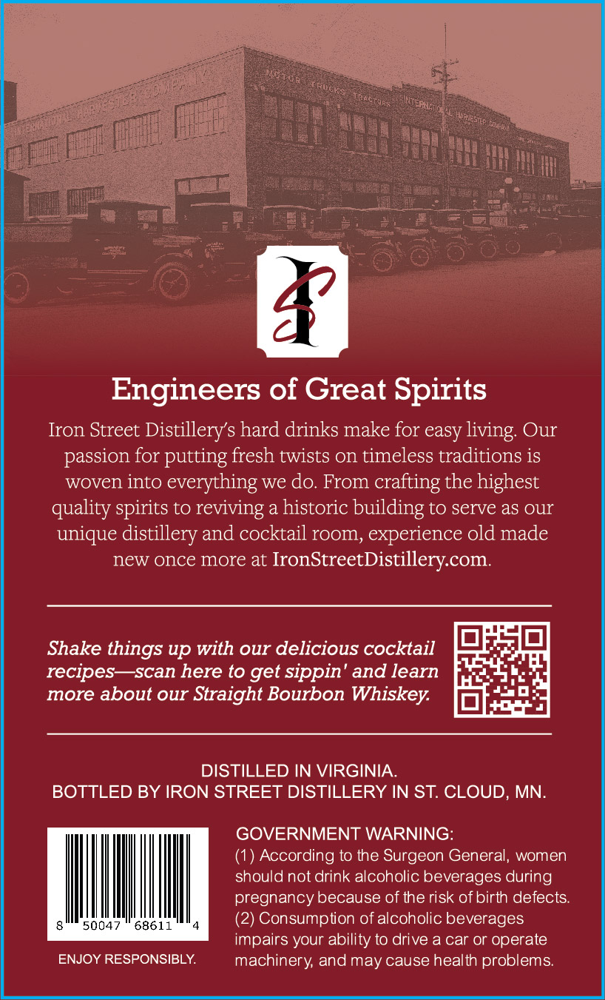

# TTB COLA Label Images - TTBID 26173001000413

**Brand Name:** 1928 BOURBON

**Issue Date:** 06/29/2026

**Origin Code:** 27

**Product Class/Type:** 101

**Source:** [TTB Public COLA Registry](https://ttbonline.gov/colasonline/viewColaDetails.do?action=publicFormDisplay&ttbid=26173001000413)

## Label Images

### Label 1

### Label 2

## Extracted Label Text

*Text extracted via OCR - may contain errors*

### Label 1

On
ae

DISTILLERY

1928 PROHIBITION

STRAIGHT BOURBON WHISKEY

### Label 2

Engineers of Great Spirits
Iron Street Distillerys hard drinks make for easy living Our
passion for putting fresh twists on timeless traditions is
woven into everything we do. From
crafting the highest
quality spirits to reviving a historic building to serve as our
unique distillery and cocktail room, experience old made
new once more at
IronStreetDistillerycom:
Shake things up with our delicious cocktail
recipes
scan here to get sippin' and learn
more about our Straight Bourbon Whiskey
DISTILLED IN VIRGINIA
BOTTLED BY IRON STREET DISTILLERY IN ST. CLOUD, MN
GOVERNMENT WARNING:
(1) According to the Surgeon General; women
should not drink alcoholic beverages during
pregnancy because of the risk of birth defects
50047
68611
(2) Consumption of alcoholic beverages
impairs your ability to drive a car or operate
ENJOY RESPONSIBLY
machinery and may cause health problems:
