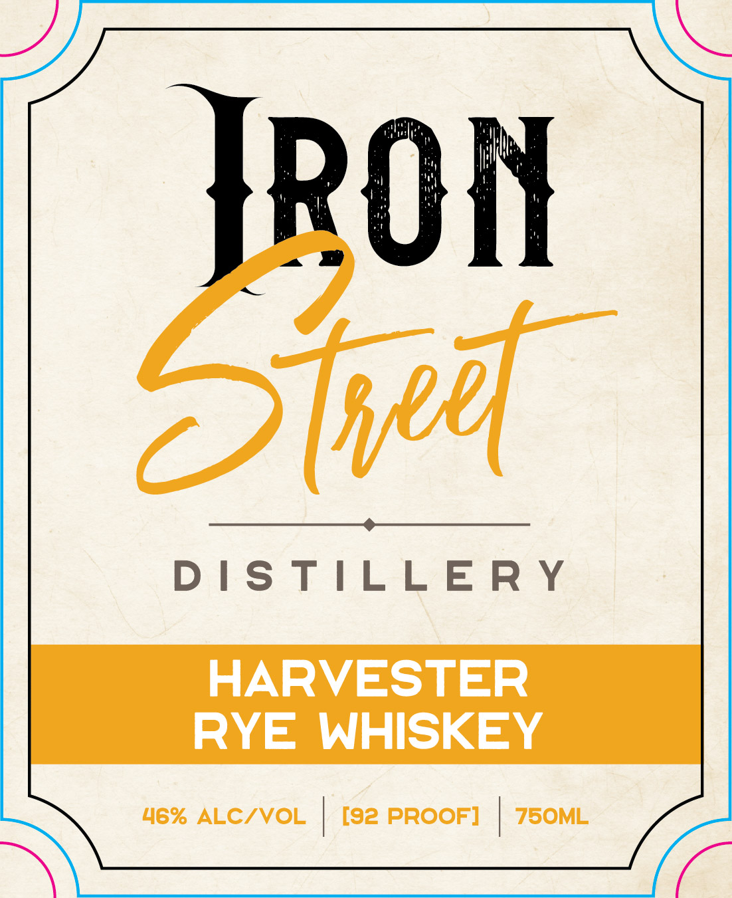
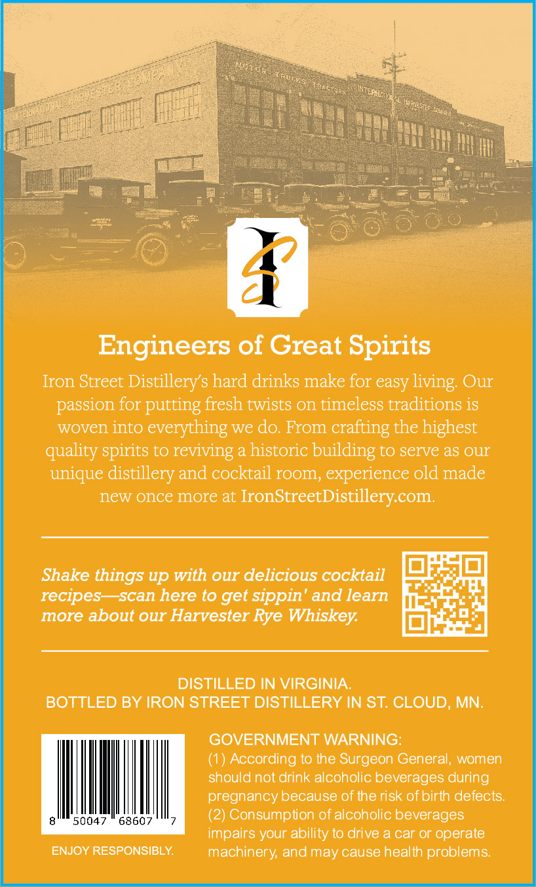

# TTB COLA Label Images - TTBID 26173001000431

**Brand Name:** HARVESTER RYE WHISKEY

**Issue Date:** 06/26/2026

**Origin Code:** 27

**Product Class/Type:** 142

**Source:** [TTB Public COLA Registry](https://ttbonline.gov/colasonline/viewColaDetails.do?action=publicFormDisplay&ttbid=26173001000431)

## Label Images

### Label 1

### Label 2

## Extracted Label Text

*Text extracted via OCR - may contain errors*

*1 image(s) excluded: text did not meet readability threshold*

### Label 2

Engineers of Great Spirits
Iron Street
Distillerys hard drinks make for easy living; Our
passion for putting fresh twists on timeless traditions is
woven into everything
do: From
crafting the highest
quality spirits to reviving a historic building to serve as our
unique distillery and cocktail room, experience old made
new once more at
IronStreetDistillery com_
Shake things up with our delicious cocktail
recipes   scan here t0 get sippin' and learn
more about our Harvester Rye
Whiskey;
DISTILLED IN VIRGINIA
BOTTLED BY IRON STREET DISTILLERY IN ST: CLOUD; MN.
GOVERNMENT WARNING:
(1) According to the Surgeon General, women
should not drink alcoholic beverages during
pregnancy because of therisk of birth defects:
50047
68607
(2) Consumpiion of alcoholic beverages
impairs your ability t0 drive a car or operate
ENJOY RESPONSIBLY
machinery; and may cause health problems;
we
