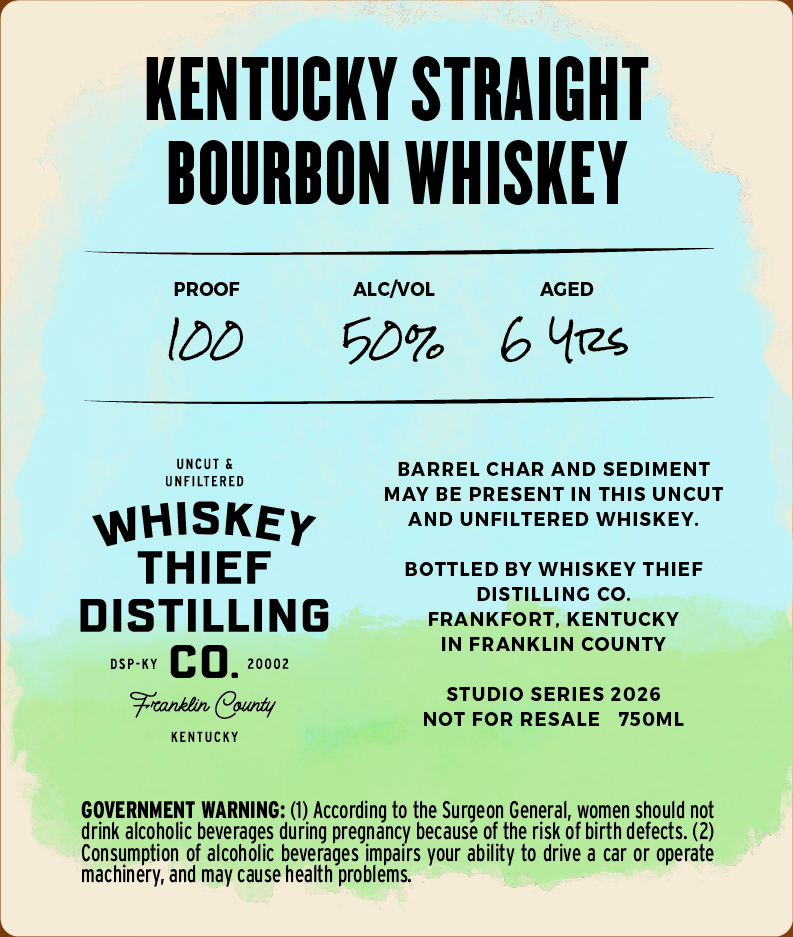
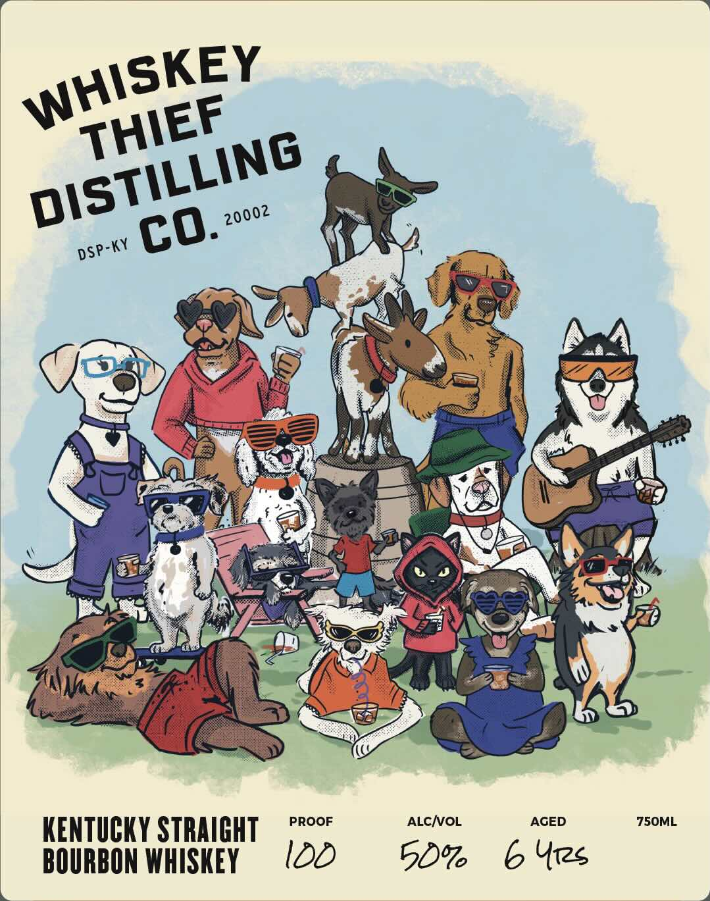

# TTB COLA Label Images - TTBID 26173001000442

**Brand Name:** WHISKEY THIEF DISTILLING CO.

**Issue Date:** 06/26/2026

**Origin Code:** 22

**Product Class/Type:** 101

**Source:** [TTB Public COLA Registry](https://ttbonline.gov/colasonline/viewColaDetails.do?action=publicFormDisplay&ttbid=26173001000442)

## Label Images

### Back Label

### Front Label

## Extracted Label Text

*Text extracted via OCR - may contain errors*

**Detected Proof:** 100

### Back Label

KENtUCKY STRAICHT
BOURBON WHISKEY
PROOF
ALCNOL
AGED
IDD
50%
6 Yrzs
Uncut
BARREL CHAR AND SEDIMENT
UNFILTERED
MAY BE PRESENT IN THIS UNCUT
WHISKEY
AND UNFILTERED WHISKEY.
THIEF
BOTTLED BY WHISKEY THIEF
DISTILLING CO_
DISTILLING
FRANKFORT, KENTUCKY
IN FRANKLIN COUNTY
DSP-KY
co.
20002
STUDIO SERIES 2026
Franklin County
NOT FOR RESALE
750ML
KenTUcKY
COVERNMENT WARNING: (0) According to the Surgeon General; women should not
drink alcoholic beverages during pregnancy because of the risk of birth defects: (2)
Consumption of alcoholic beverages impairs your ability to drive
car or operate
machinery; and may cause health problems

### Front Label

PROOF
ALCNOL
AGED
750ML
KENTuCKY STRAIGHT
BOURBON WhISKEY
IDD
50%
6 U1s
WHISKEY
THIEF
DISTILLING
20002
co.
DSP-KY
