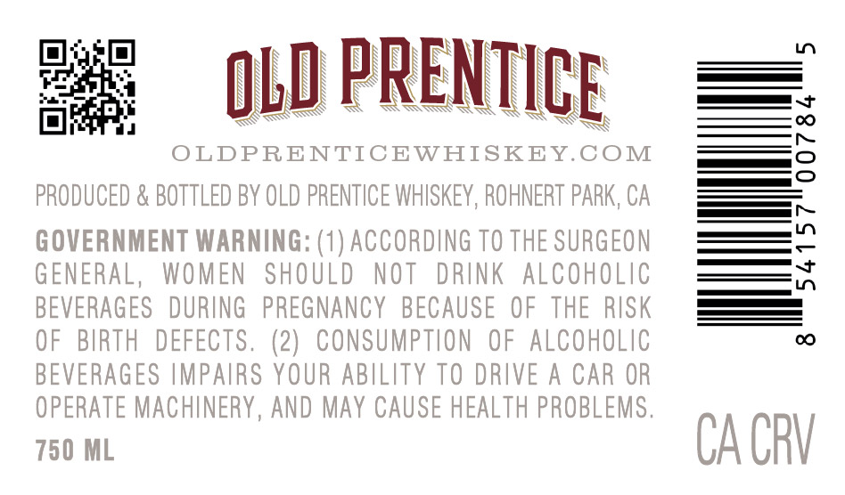
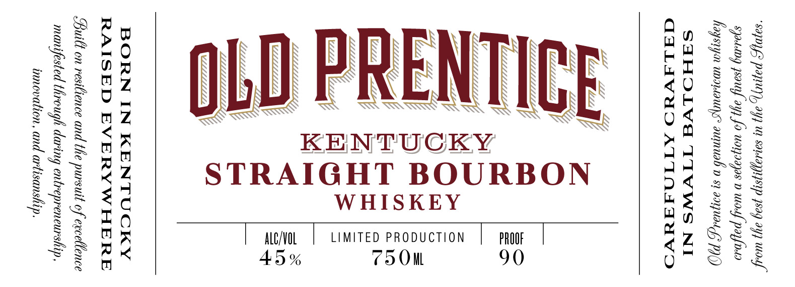
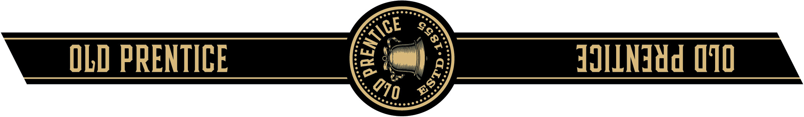
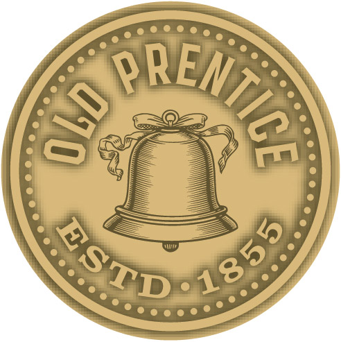

# TTB COLA Label Images - TTBID 26173001000463

**Brand Name:** OLD PRENTICE

**Issue Date:** 07/14/2026

**Origin Code:** 01

**Product Class/Type:** 101

**Source:** [TTB Public COLA Registry](https://ttbonline.gov/colasonline/viewColaDetails.do?action=publicFormDisplay&ttbid=26173001000463)

## Label Images

### Back Label

### Front Label

### Label 3

### Label 4

## Extracted Label Text

*Text extracted via OCR - may contain errors*

*2 image(s) excluded: text did not meet readability threshold*

**Detected Proof:** 90

### Back Label

Ln
OLD PRENTICE
OLDPRENTICEWHISKEY.COM
2
PRODUCED & BOTTLED BY OLD PRENTICE WHISKEY , ROHNERT PARK, Ca
GOVERNMENT WARNING: (1) ACCORDING TO THE SURGEON
{
GENERAL,
WOMEN
SHOULD
NOT
DRINK
ALCohoLic
BEVERAGES   DURING
PREGNANCY   BECAUSE
OF THE RISK
OF   BIRTH
DEFECTS. (2)
CONSUMPTLON   OF ALCOHOLIC
0
BEVERAGES IMPAIRS YOUR ABILITY TO DRIVE A CAR OR
OPERATE MAChUNERY , AND May CAUSE HEALTH PROBLEMS ,
750 ML
CA CRV

### Front Label

“SapDYPS papey), ay) Uh sarlaygnsip 7809 ay) wos”
Spotl) psautyf ay) fo Uuayaajas D wou} payfoso
faysiyn UDILLAUYS aumnuab n 81 Aaya; PC)
SHHOLVA TIVWS NI
GQaALAVAD ATTONAAAVO

NTIC

| Ale/VOL | LIMITED PRODUCTION | PROOF |

|
a
KENTUCKY
STRAIGHT BOURBO

45%

PRE

BORN IN KENTUCKY
RAISED EVERYWHERE

Built on resitience and the pursuit of excellence
manifested through daring entrepreneurship,
innovation, and artisanshi ip
