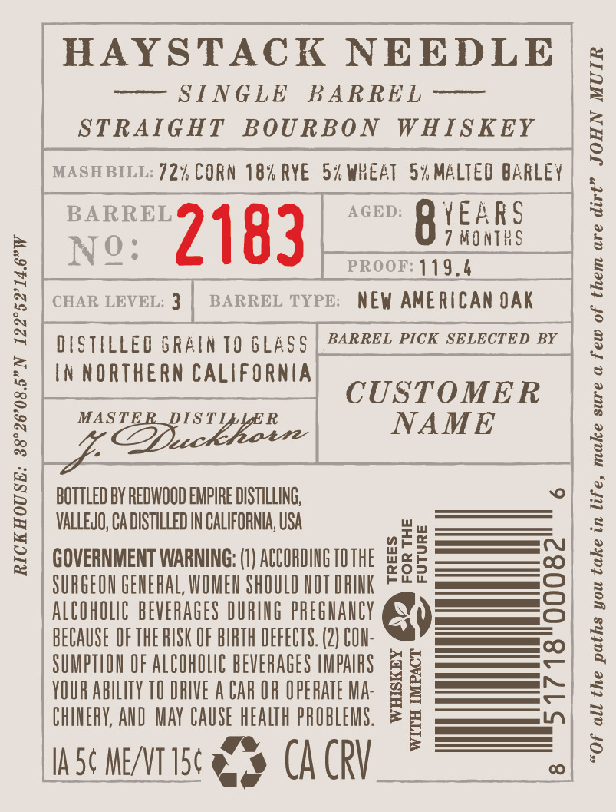
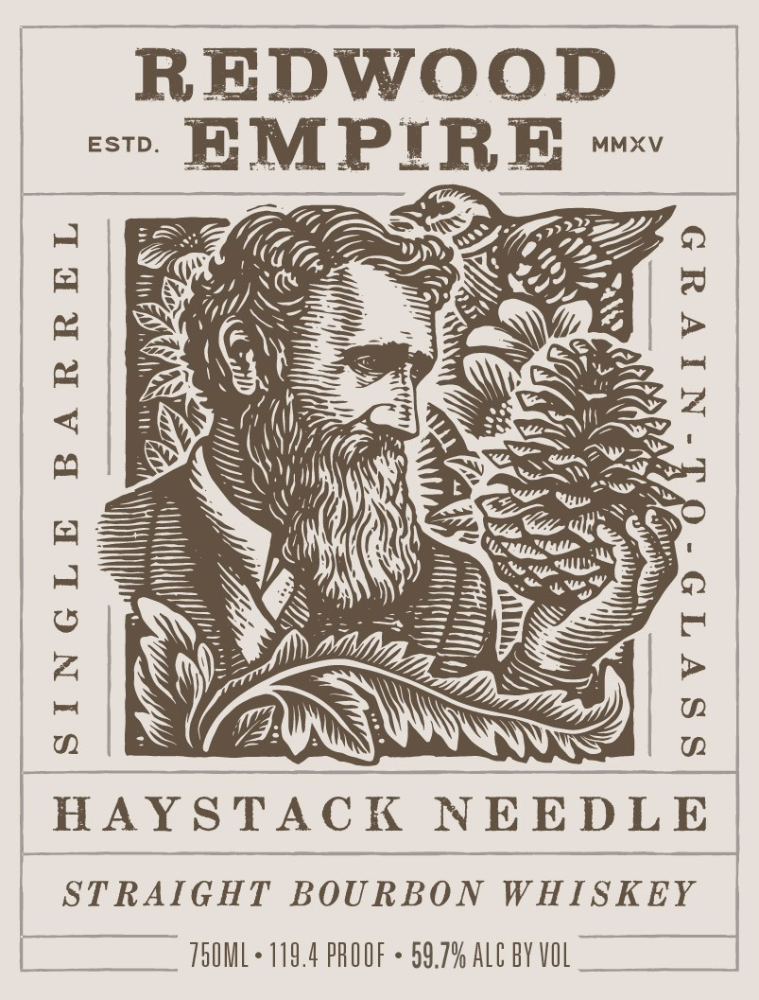

# TTB COLA Label Images - TTBID 26173001000617

**Brand Name:** REDWOOD EMPIRE

**Fanciful Name:** HAYSTACK NEEDLE

**Issue Date:** 06/30/2026

**Origin Code:** 01

**Product Class/Type:** 101

**Source:** [TTB Public COLA Registry](https://ttbonline.gov/colasonline/viewColaDetails.do?action=publicFormDisplay&ttbid=26173001000617)

## Label Images

### Back Label

### Label 1

### Label 3

## Extracted Label Text

*Text extracted via OCR - may contain errors*

**Detected Proof:** 119.4

### Back Label

RICKHOUSE: 38°26'08.5”N 122°52’14.6"W

HAYSTACK NEEDLE

7 SINGLE BARKEL ———
STRAIGHT BOURBON WHISKEY

MASHBILL: 724 CORN 184 RYE SAWKEAT 5%MALTEO BARLEY

wo. 2.183 ace: O YEARS

7 MONTES
CHAR LEVEL: 3 | BARREL TYPE: NEW AMERICAN OAK

PROOF: 119.4
ae GRAIN TO GLASS BARREL PICK SELECTED BY
IN NORTHERN CALIFORNIA

CUSTOMER

mcrsspenyes | NAME

BOTTLED BY REDWOOD EMPIRE DISTILLING,
VALLEJO, CA DISTILLED IN CALIFORNIA, USA

6

wef
GOVERNMENT WARNING: (I) ACCORDING OTHE x2 ——=o5
SURGEON GENERAL WOMEN SHOULD NOT DRINK FS es
ALCOHOLIC BEVERAGES DURING PREGNANCY Qs
BECAUSE OF THERISK OF BIRTH DEFECTS. (2) COU: 2” ——c.,
SUMPTION OF ALCOMOLIC BEVERAGES INFARS && ———
HAKKAR —h
CHINERY, AND MAY CAUSE HEALTH PROBLEMS. [—

In Sc ME/VT15¢ ago CA CRV

“Of all the paths you take in life, make sure a few of them are dirt” JOHN MUIR

### Label 1

REDWOOD
ESTD
BMPIRE
MMXV
1
1
1
7
2
02
HAYS TAC K
NEEDL E
ST RAIGHT
BOURBON W HISKEY
750ML - 119.4 PROOF
59.79 ALC BY VOL

### Label 3

HAYSTACK NEEDLE
SINGLE BARREL + GRAIN-TO-GLASS
STRAIGHT BOURBON WHISKEY

“wire DISTILLER

TaaavVa
ATONIS
SINGLE
BARREL
