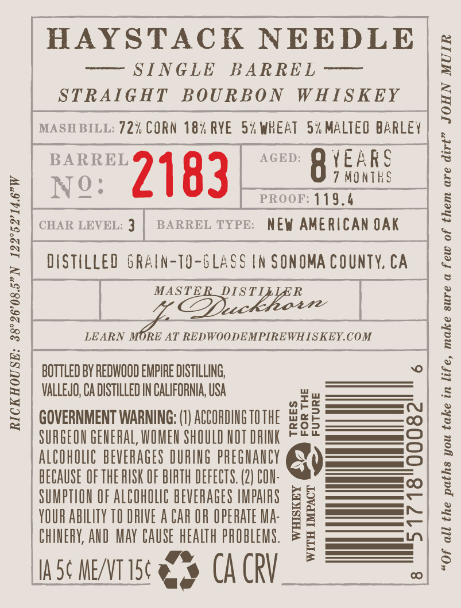

# TTB COLA Label Images - TTBID 26173001000625

**Brand Name:** REDWOOD EMPIRE

**Fanciful Name:** HAYSTACK NEEDLE

**Issue Date:** 06/30/2026

**Origin Code:** 01

**Product Class/Type:** 101

**Source:** [TTB Public COLA Registry](https://ttbonline.gov/colasonline/viewColaDetails.do?action=publicFormDisplay&ttbid=26173001000625)

## Label Images

### Back Label

### Label 1

### Label 3

## Extracted Label Text

*Text extracted via OCR - may contain errors*

**Detected Proof:** 119.6

### Back Label

HAYSTACK NEEDLE

= SINGLE BARRED
STRAIGHT BOURBON WHISKEY

MASHBILL: 724 CORN 18% RYE SAWHKEAT 5%MALTEO BARLEY

ara a 83 AGED: YEARS
. 7 MONTHS
No £ PROOF: 119.6

BARREL TYPE: NEW AMERICAN OAK

CHAR LEVEL: 3

DISTILLED GRAIN-TO-GLASS IN SONOMA COUNTY, CA

LEARN MORE AT REDWOODEMPIREWHISKEY.COM

6

BOTTLED BY REDWOOD EMPIRE DISTILLING,
VALLEJO, CA DISTILLED IN CALIFORNIA, USA

GOVERNMENT WARNING: (1) ACCORDING 10 THE
SURGEON GENERAL WOMEN SHOULD NOT DRINK
ALCOHOLIC BEVERAGES DURING PREGNANCY
BECAUSE OF THE RISK OF BIRTH DEFECTS. (2) CON-
SUMPTION OF ALCOHOLIC BEVERAGES IMPAIRS
YOUR ABILITY 10 DRIVE A CAR OR OPERATE MA-
CHINERY, AND MAY CAUSE HEALTH PROBLEMS.

IAS¢ ME/VTI5¢ AS CA CRV

RICKHOUSE: 38°26'08.5”N 122°52'14.6"W

TREES
FOR THE

(de)
wy = FUTURE

51718°00082
“Of all the paths you take in life, make sure a few of them are dirt” JOHN MUIR

WHISKEY
WITH IMPACT

8 |

### Label 1

REDWOOD
ESTD
BMPIRE
MMXV
1
1
1
7
2
02
HAYS TAC K
NEEDL E
ST RAIGHT
BOURBON W HISKEY
750ML - 119.4 PROOF
59.79 ALC BY VOL

### Label 3

HAYSTACK NEEDLE
SINGLE BARREL + GRAIN-TO-GLASS
STRAIGHT BOURBON WHISKEY

“wire DISTILLER

TaaavVa
ATONIS
SINGLE
BARREL
