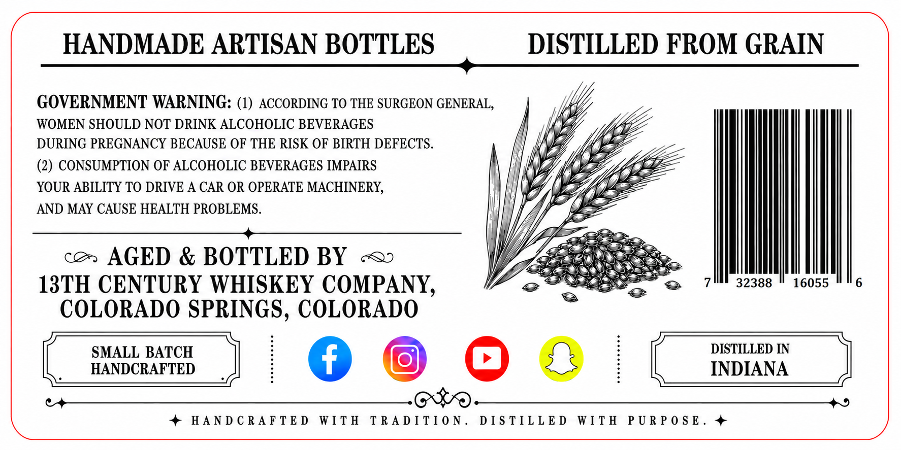
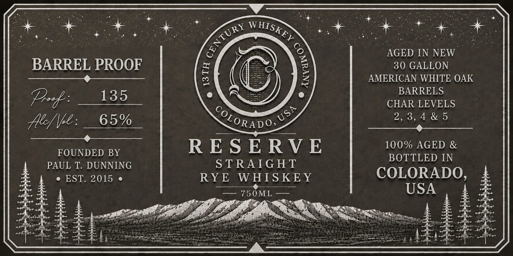

# TTB COLA Label Images - TTBID 26173001000643

**Brand Name:** 13TH CENTURY WHISKEY COMPANY

**Issue Date:** 06/26/2026

**Origin Code:** 13

**Product Class/Type:** 102

**Source:** [TTB Public COLA Registry](https://ttbonline.gov/colasonline/viewColaDetails.do?action=publicFormDisplay&ttbid=26173001000643)

## Label Images

### Back Label

### Front Label

## Extracted Label Text

*Text extracted via OCR - may contain errors*

### Back Label

HANDMADE ARTISAN BOTTLES DISTILLED FROM GRAIN
aia
GOVERNMENT WARNING: (1) ACCORDING TO THE SURGEON GENERAL, | Ae
WOMEN SHOULD NOT DRINK ALCOHOLIC BEVERAGES , \ WY fl
DURING PREGNANCY BECAUSE OF THE RISK OF BIRTH DEFECTS. V7 JAA
(2) CONSUMPTION OF ALCOHOLIC BEVERAGES IMPAIRS WG, iy jE
YOUR ABILITY TO DRIVE A CAR OR OPERATE MACHINERY, () Y M yy lez
AND MAY CAUSE HEALTH PROBLEMS. LAP BE

Wi) Y, ZT) (oye
WV ERR,

cen AGED & BOTTLED BY «<> YY SERS

AGES ESS
13TH CENTURY WHISKEY COMPANY, oo ORI 7! 32388 "16055 Mle
COLORADO SPRINGS, COLORADO
SMALL BATCH DISTILLED IN
_ HANDCRAFTED | ; INDIANA
4 $$ _____.@$9.____________________4
+ HANDCRAFTED WITH TRADITION. DISTILLED WITH PURPOSE. #

### Front Label

° + : ae : + > sm + + SS SIDS oe : = a + +: so *
of ‘2, | AGED INNEW
BARREL PROOF = CG 5 secnuna
wa ee e] = Z AMERICAN WHITE OAK
os BARRELS
Pref US a es di CaneMretS
flee: __ 65% _ CORAD OL a ease ae
SORSERIE SEE yas ower bs 2. cae
FOUNDED BY RESERVE 100% AGED &
PAUL T. DUNNING STRAIGHT BOTTLED IN
° EST. 2015 « RYE WHISKEY COLORADO,
: 750ML — USA E
Ir re pete be ee a asigirteesl ee fee “A= ES ‘s fren
