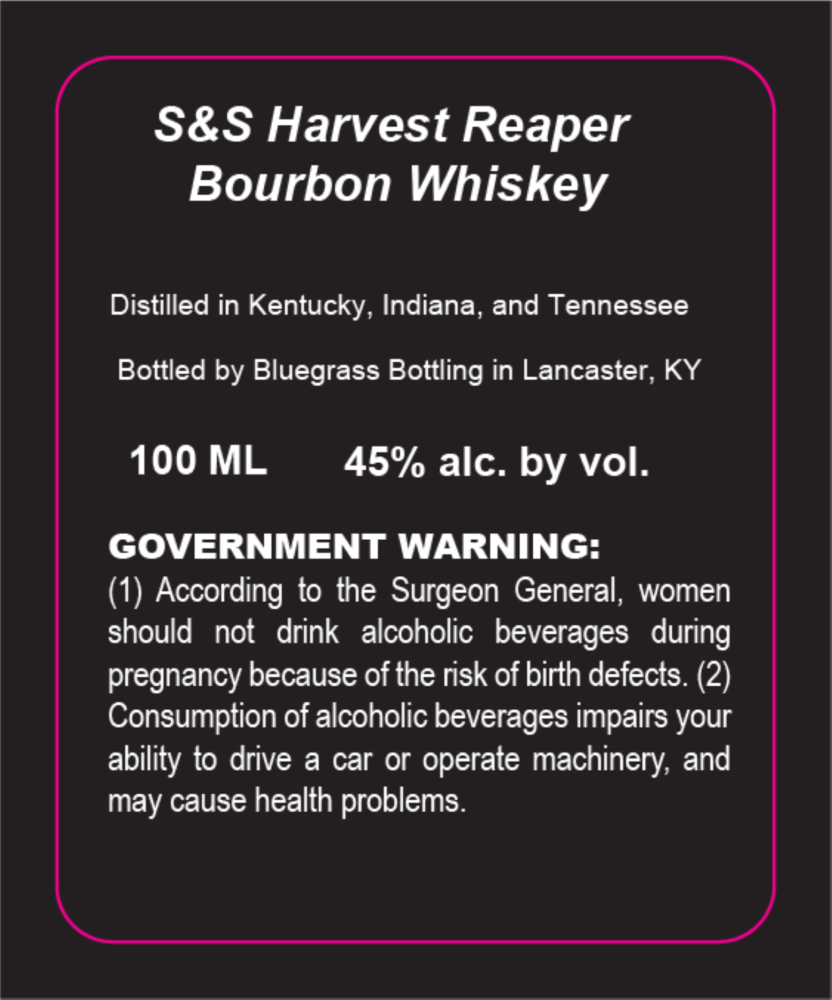

# TTB COLA Label Images - TTBID 26173001000699

**Brand Name:** S & S HARVEST REAPER

**Issue Date:** 07/01/2026

**Origin Code:** 22

**Product Class/Type:** 141

**Source:** [TTB Public COLA Registry](https://ttbonline.gov/colasonline/viewColaDetails.do?action=publicFormDisplay&ttbid=26173001000699)

## Label Images

### Label 1

## Extracted Label Text

*Text extracted via OCR - may contain errors*

**Detected Proof:** 90

### Label 1

S&S Harvest Reaper
Bourbon Whiskey

Distilled in Kentucky, Indiana, and Tennessee

Bottled by Bluegrass Bottling in Lancaster, KY

100ML 45% alc. by vol.

GOVERNMENT WARNING:

(1) According to the Surgeon General, women
should not drink alcoholic beverages during
pregnancy because of the risk of birth defects. (2)
Consumption of alcoholic beverages impairs your
ability to drive a car or operate machinery, and
may cause health problems.
