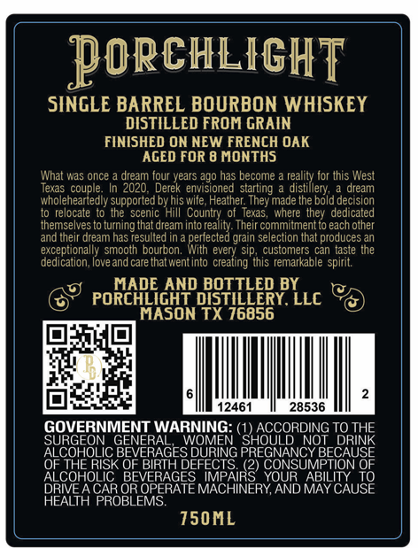
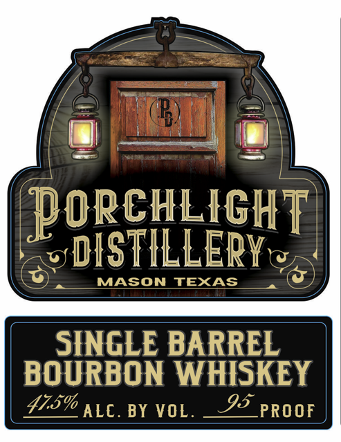

# TTB COLA Label Images - TTBID 26173001000729

**Brand Name:** PORCHLIGHT DISTILLERY

**Issue Date:** 06/26/2026

**Origin Code:** 44

**Product Class/Type:** 141

**Source:** [TTB Public COLA Registry](https://ttbonline.gov/colasonline/viewColaDetails.do?action=publicFormDisplay&ttbid=26173001000729)

## Label Images

### Back Label

### Front Label

## Extracted Label Text

*Text extracted via OCR - may contain errors*

### Back Label

PoRcHLIGHT
SINGLE BARREL BOURBON WHISKEY
DISTILLED FROM GRAIN
FINISHED ON NEW FRENCH OAK
AGED FOR 8 MONTHS
was once
dream four years ago has become
Ior this West
Jlexas
couple:
In 2020 . Derek envisioned starting
reasimeor
dream
wholehearledly supported by his wife, Healher They made the bold decision
to relocate to the scenic Hill Country of Texas,
where Ihej  dedicated
themselves to turning that dream into reality: Their commitment to each other
andineir dream nas
esulted In
petfe cteer grain selescoorethatarodusces ae
exceptionally smooth bourbon
every Sip;
customers can taste ine
dedication
love and care that wentinto
creating this remarkable spirit
MADE AND BOTTLED BY
PORCHLIGHT DISTILLERY. LLC
MASON TX 76856
12461
28536
GOVERNMENT
WARNING; C
ACCORDING TO
TORTHE
SURGEON
GENERAL
SHOULD
NOT
ALCOHOLIC BEVERAGES DURING PREGNANCY BECAUSE
OF THE RISK OF BIRTH
COUSUNBILION %0}
ALCOHOLIC
BEVERAGES
PEncanEne
ABILITY
DRIVEA CAR OR OPERATE
AND MAY CAUSE
HEALTH PROBLEMS
150ML
What

### Front Label

PorchL IGH T]
DISTILLEPYe
MASON
TEXAS
SINGLE BARREL
BOURBON WHISKEY
475% ALC. BY VOL.
95_PROOF
