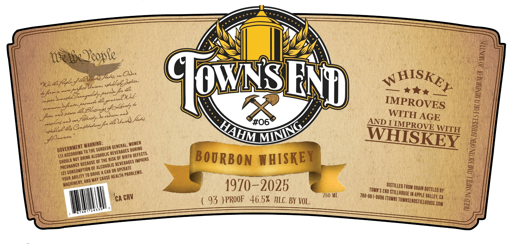

# TTB COLA Label Images - TTBID 26173001000813

**Brand Name:** TOWN'S END STILLHOUSE

**Issue Date:** 07/17/2026

**Origin Code:** 01

**Product Class/Type:** 141

**Source:** [TTB Public COLA Registry](https://ttbonline.gov/colasonline/viewColaDetails.do?action=publicFormDisplay&ttbid=26173001000813)

## Label Images

### Label 1

## Extracted Label Text

*Text extracted via OCR - may contain errors*

**Detected Proof:** 93

### Label 1

be Jeople
2
3 Jnshs,
in
OxSet
JU-Ifesl
2534
Jl
Cwsi
Sorushe
Je
JE Bles-os
Aw,
axs
uuly'
Zas
ain
fashs
#06
AND I
AGE
I
IMPROVE WITH
mtica"
WSKEY
TO THE
[11
OF THE RISK @F
BOURBON WHISKEY
0
OF
OR
[21
To DRIVE A CAR
YOUR
AnD May
1970-2025
Exdistilled
GRAIN
BY
'150 ML
760-961-8696 ,
'In apple Valley; Ca
CA
93 }PROOF   46.5%  TLC. BY VOL
COM
ENp
~HISKE}
9JE
SA
"z9ene1D)UZ
IMPROVES
inn6
ptry
Syncess
Peey
Crlrot 5
WITH
~xJ
feente
061]
eutfeles
@nsuknA
HAHM
MINING
evallse s
PA;
WARNING:
WOMEN
GENERAL,
GOVERNMENT
'SURGEON '
DURING
BEVERAGES
ACCORDING
AlcOHOLIC
 DEFECTS:
BIRTH
'DRINK
NOT
'IMPAIRS
SHOULD
BEVERAGES
'BECAUSE [
PREGNANCY
ALCOHOLIC
 OPERATE
{CONSUMPTION
PROBLEMS:
HEALTH
ABILITY
'CAUSE
MACHINERY,
FROM =
BOTTLED
TOWN"S
STILLHOUSE
CRV
(TOWN) `
TOWNSENDSTILLHOUSE.
