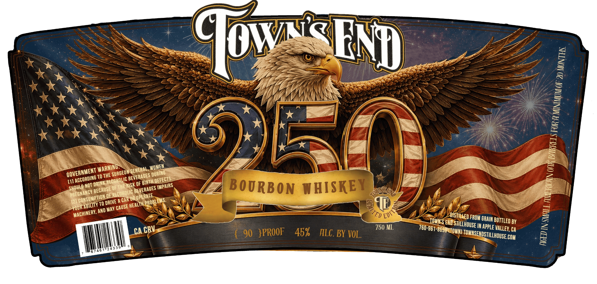

# TTB COLA Label Images - TTBID 26173001000820

**Brand Name:** TOWN'S END STILLHOUSE

**Issue Date:** 07/17/2026

**Origin Code:** 01

**Product Class/Type:** 141

**Source:** [TTB Public COLA Registry](https://ttbonline.gov/colasonline/viewColaDetails.do?action=publicFormDisplay&ttbid=26173001000820)

## Label Images

### Label 1

## Extracted Label Text

*Text extracted via OCR - may contain errors*

**Detected Proof:** 90

### Label 1

Jows
8
1
TO THE
[11
NOT
OYMUE BEX DF
BOURBON WHISKEY
4
OE
{2]
A CAK OR
TO
 HEALTH
[UUR
AND MAY
IoWKcS END -
FROM GRAIN
BY
750 ML
IM appLe
Ca
CA
90  }PROOF
45%
ALC . BY VOL
COM
Fnp
1
1
WOMEN
WARNIN6:
NGENERAL ,
GOVERNMENT
SURGEOMT
; DURINO
BEVERAGES
ACCORDING
LDEFECTS;
BIATH I
DRINK
IMPAIRS
SHOUL D
BEVERAGES [
BECAUSE
PRECNANCY
ALCOHOLIC
LOPERATE
~CONSUMPTION L
LPROBLEMS.
DRIVE
ABICITY
'CAUSE
VUTED `
1
MACHINERY,
EDI `
'DISTILLED
BOTTLED '
STILLHOUSE
760-961-8696 KTOWH)
valley,
CRV
) TOWNSENDSTILLHOUSE .
