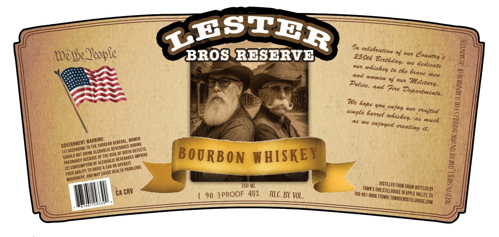

# TTB COLA Label Images - TTBID 26173001000826

**Brand Name:** TOWN'S END STILLHOUSE

**Issue Date:** 07/17/2026

**Origin Code:** 01

**Product Class/Type:** 141

**Source:** [TTB Public COLA Registry](https://ttbonline.gov/colasonline/viewColaDetails.do?action=publicFormDisplay&ttbid=26173001000826)

## Label Images

### Label 1

## Extracted Label Text

*Text extracted via OCR - may contain errors*

**Detected Proof:** 90

### Label 1

ZrStER
7
Iegbe Zeople
BROS RESERVE
%8 amr
a4r
ta the
and
men
08 0c2
and
Zire
We
4a4
enjay aur
cingle
eadted
a
a muce
enjayed
d.
TO THE
[11
NOT
OF THE RISK QF
BOURBON WHISKEY
OF
OR
[2]
A CAR
TO
YOUR
And May
'150 ML
END
BRAIN BOTTLED BY
CA
{
90 }PROOF 45%
FLC . BY VOL.
IN apple
CA
LCOM
1
celebnation
Country
2s0th
Birthday:
We
dedicate
uhiskey
baue
1
women
Militany .
Palice,
Depantmenta-
hope
banel
whiskey ,
We
eneating
I
WARNING:
WOMEN
GENERAL ,
GOVERNMENT
SURGEON 5
'DURING
' BEVERAGES /
ACCORDING
DEFECTS:
'ALCOHOLIC
'BIRTH
DRINK
IMPAIRS
SHOULD
{BEVERAGES
'BECAUSE E
PREGHANCY
'ALCOHOLIC [
OPERATE
[ CONSUMPTION =
PROBLEMS.
DRIVE -
 HEALTH
ABILITY ~
CAUSE
MACHINERY;
distilled $
FROM
TOWN"S
CRV
 STILLHOUSE
780-961-8696
valley,
(TOWN] "
TOWNSENDSTILLHOUSE.
7433=
