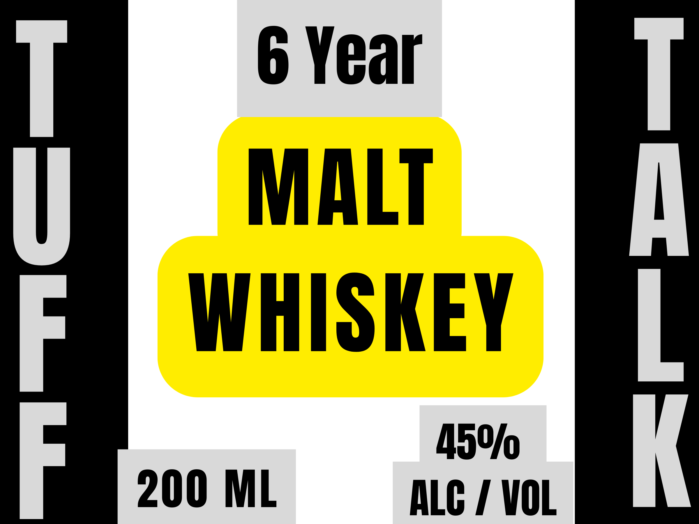
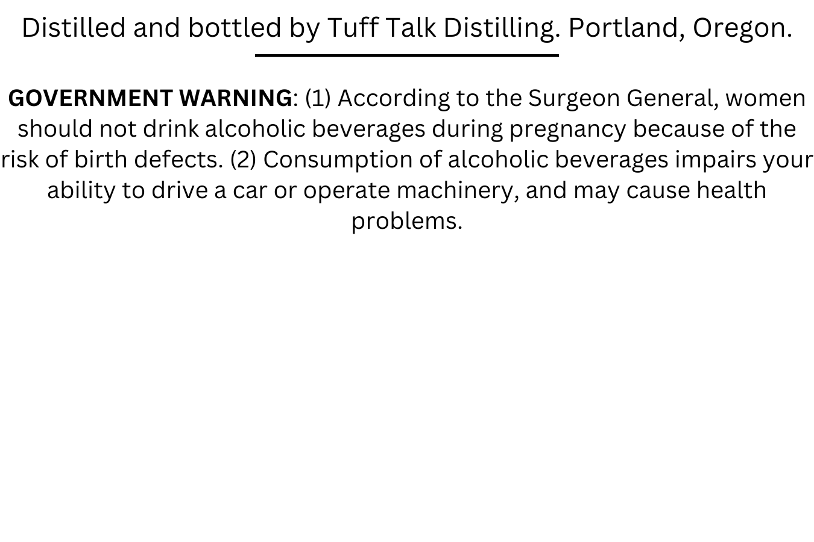

# TTB COLA Label Images - TTBID 26174001000086

**Brand Name:** TUFF TALK

**Issue Date:** 06/29/2026

**Origin Code:** 38

**Product Class/Type:** 140

**Source:** [TTB Public COLA Registry](https://ttbonline.gov/colasonline/viewColaDetails.do?action=publicFormDisplay&ttbid=26174001000086)

## Label Images

### Front Label

### Label 2

## Extracted Label Text

*Text extracted via OCR - may contain errors*

**Detected Age:** 6 Years

### Front Label

6 Year

MALT

WHISKEY

200 ML

ALG / VOL

A450

### Label 2

Distilled and bottled by Tuff Talk Distilling: Portland, Oregon:
GOVERNMENT WARNING: (1) According to the Surgeon General; Women
should not drink alcoholic beverages during pregnancy because of the
risk of birth defects (2) Consumption of alcoholic beverages impairs your
ability to drive a car or operate machinery, and may cause health
problems:
