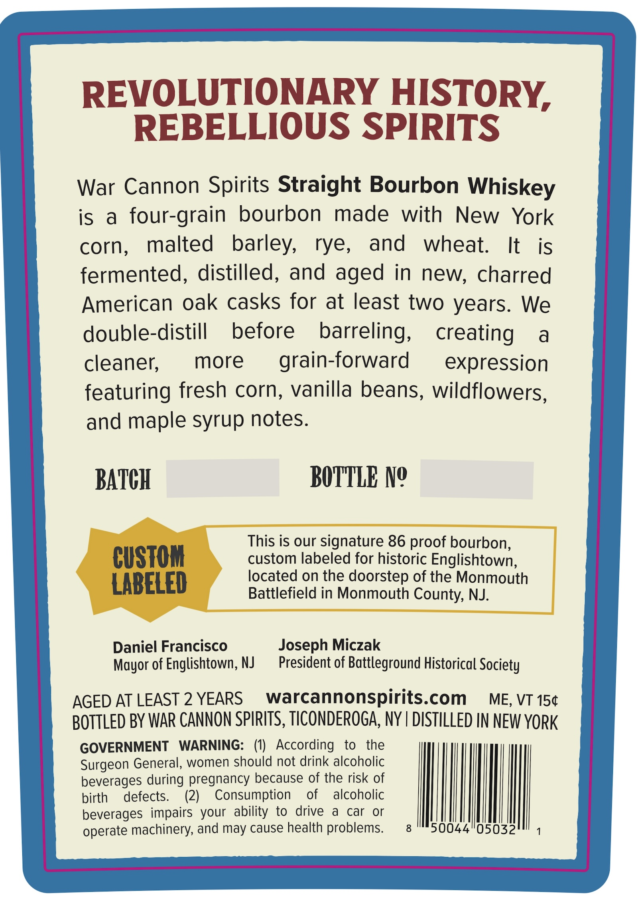
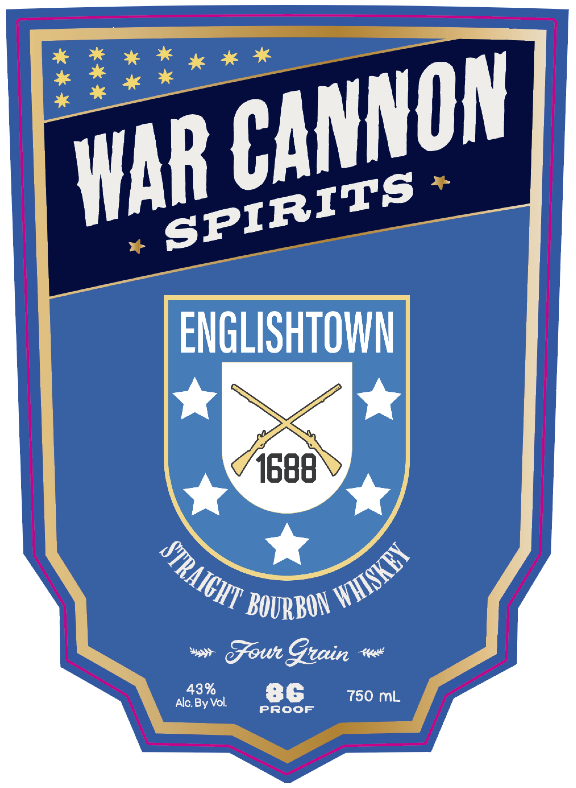

# TTB COLA Label Images - TTBID 26174001000121

**Brand Name:** WAR CANNON SPIRITS

**Fanciful Name:** ENGLISHTOWN STRAIGHT BOURBON WHISKEY

**Issue Date:** 07/02/2026

**Origin Code:** 02

**Product Class/Type:** 101

**Source:** [TTB Public COLA Registry](https://ttbonline.gov/colasonline/viewColaDetails.do?action=publicFormDisplay&ttbid=26174001000121)

## Label Images

### Back Label

### Front Label

## Extracted Label Text

*Text extracted via OCR - may contain errors*

**Detected Proof:** 86
**Detected Age:** 2 Years

### Back Label

REVOLUTIONARY HISTORY,
REBELLIOUS SPIRITS
War Cannon Spirits Straight Bourbon Whiskey
is
a
four-grain
bourbon
made
with
New
York
corn;
malted
barley,
rye,
and
wheat.
It
is
fermented, distilled, and aged in new, charred
American oak casks for at least two years:
We
double-distill
before
barreling,
creating
a
cleaner;
more
grain-forward
expression
featuring fresh corn, vanilla beans, wildflowers,
and maple syrup notes:
BATCH
BOTTLE Ne
This is our signature 86 proof bourbon,
CUSTOM
custom labeled for historic Englishtown;
LABELED
located on the doorstep of the Monmouth
Battlefield in Monmouth County, NJ:
Daniel Francisco
Joseph Miczak
Mayor of Englishtown, NJ
President of Battleground Historical Society
AGED AT LEAST 2 YEARS
warcannonspirits.com
ME, VT 150
BOTTLED BY WAR CANNON SPIRITS, TICONDEROGA, NY | DISTILLED IN NEW YorK
GOVERNMENT
WARNING:
(0)   According
to
the
Surgeon General, women should not drink alcoholic
beverages during pregnancy because of the risk of
birth
defects.
(2)
Consumption
of
alcoholic
beverages impairs your ability to
drive
a
car
or
machinery, and may cause health problems.
8
50044"05032
operate

### Front Label

ENGLISHTOWNN
1688
BOURBON
Gowr Grain
43%
86
750 mL
Alc By Vol
Proof
CANNON
WAR
SPIRITS
STRAiCHT
WHISKEY
