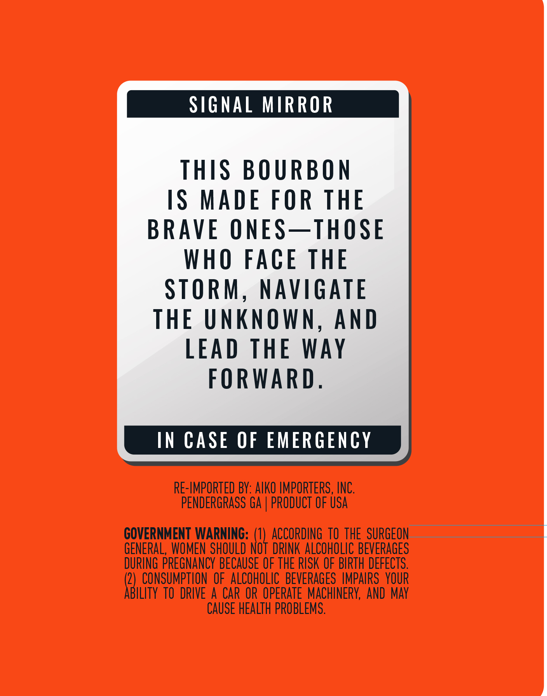
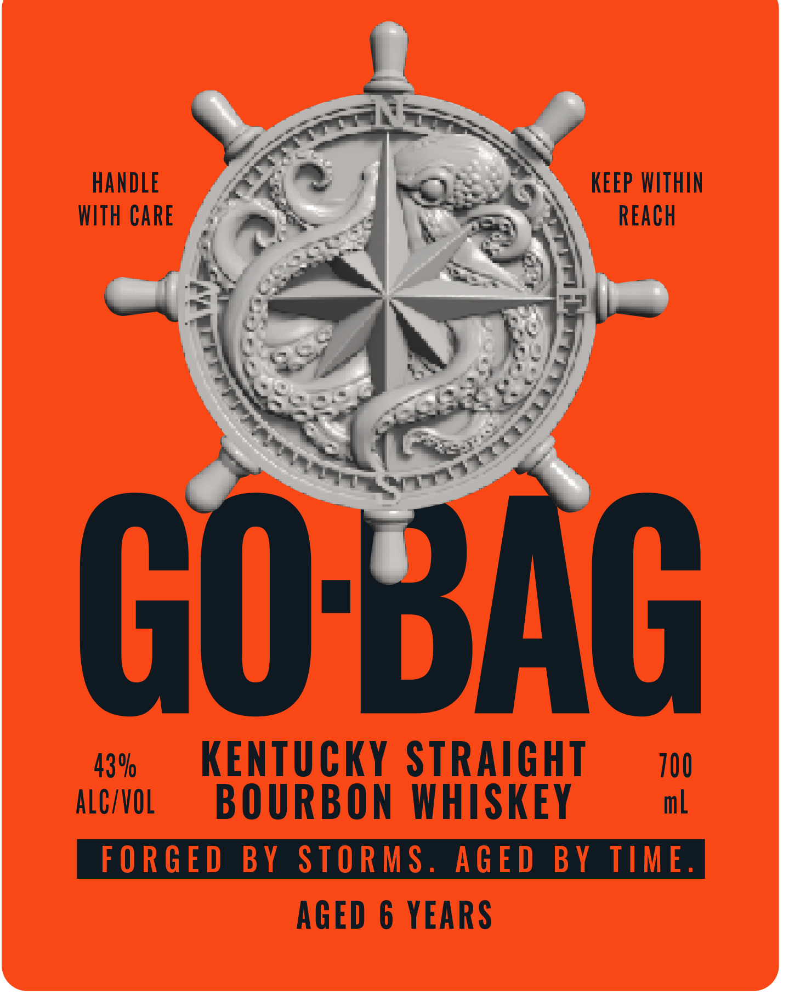
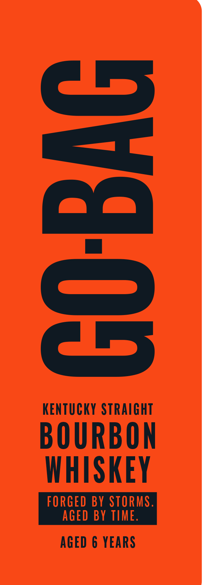

# TTB COLA Label Images - TTBID 26174001000184

**Brand Name:** GO-BAG

**Issue Date:** 06/29/2026

**Origin Code:** 22

**Product Class/Type:** 101

**Source:** [TTB Public COLA Registry](https://ttbonline.gov/colasonline/viewColaDetails.do?action=publicFormDisplay&ttbid=26174001000184)

## Label Images

### Back Label

### Front Label

### Label 2

### Label 3

## Extracted Label Text

*Text extracted via OCR - may contain errors*

*1 image(s) excluded: text did not meet readability threshold*

**Detected Proof:** 86
**Detected Age:** 6 Years

### Back Label

SIGNAL MRROR
THIS BO URBON
IS
MADE FOR THE
BRAVE ONES_THOSE
WHO
FAce THE
STORM,
NAVIGATE
THE UNKNOWN, And
LEAD THE
WAy
FORWARD;
IN CASE OF EMERGENCY
RE-IMPORTED BY: AIKO IMPORTERS , INC.
PENDERGRASS GA
PRODUCT OF USA
GOVERNMENT WARNING: (1)  ACCORDING  TO THE SURGEON
GENERAL, WOMEN SHOULD NOT  DRINK ALCOHOLIC BEVERAGES
DURING PREGNANCY BECAUSE OF THE RISK OF BIRTH DEFECTS.
2)   CONSUMPTION oF  ALCOHOLIC  BEVERAGES  IMPAIRS  YOUR
ABILITY tO DRIVE
A
CAR OR OPERATE  MACHINERY, AND May
CAUSE HEALTH PROBLEMS.

### Front Label

HANDLE

KEEP WITHIN

WITH CARE

REACH

43%

KENTUCKY STRAIGHT

100

ALC/VOL

BOURBON WHISKEY

ml

AGED 6 YEARS

### Label 3

3
KENTUCKY STRAIGHT
BOURBON
WHISKEY
FORGED BY STORMS_
AGED BY TIME.
AGED 6 YEARS
