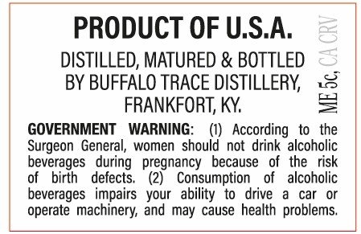
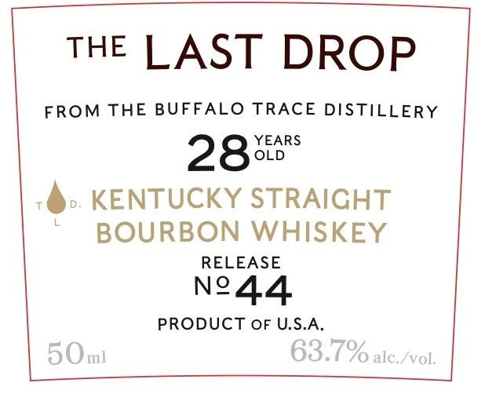

# TTB COLA Label Images - TTBID 26174001000232

**Brand Name:** THE LAST DROP

**Issue Date:** 06/26/2026

**Origin Code:** 22

**Product Class/Type:** 101

**Source:** [TTB Public COLA Registry](https://ttbonline.gov/colasonline/viewColaDetails.do?action=publicFormDisplay&ttbid=26174001000232)

## Label Images

### Back Label

### Front Label

## Extracted Label Text

*Text extracted via OCR - may contain errors*

### Back Label

PRODUCT OF U.SA,
3
DISTILLED; MATURED & BOTTLED
BY BUFFALO TRACE DISTILLERY;
4
FRANKFORT; KY:
GOVERNMENT
WARNING:
According   to   the
Surgeon General, women  should not drink` alcoholic
beverages
during
pregnancy
because   of   the   risk
birth
defects_
(2)
Consumption
alcoholic
beverages   impairs   your   ability  to   drive
car
operate  machinery; and may cause health problems

### Front Label

THE LAST DROP

FROM THE BUFFALO TRACE DISTILLERY

YEARS

28

OLD

6). KENTUCKY STRAIGHT

BOURBON WHISKEY

RELEASE

N44

PRODUCT OF U.S.A.
