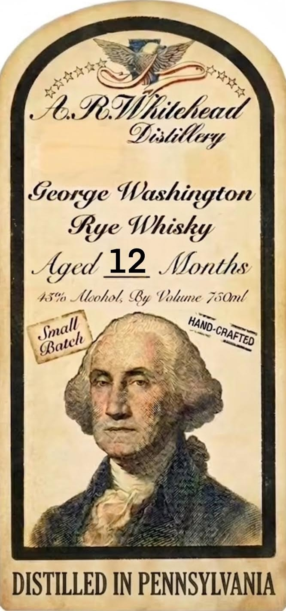
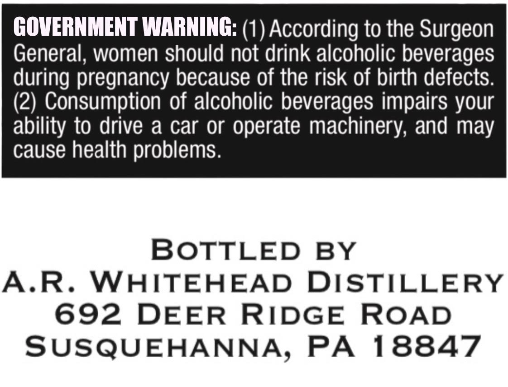

# TTB COLA Label Images - TTBID 26174001000237

**Brand Name:** A.R. WHITEHEAD DISTILLERY

**Fanciful Name:** GEORGE WASHINGTON RYE WHISKY

**Issue Date:** 07/02/2026

**Origin Code:** 39

**Product Class/Type:** 142

**Source:** [TTB Public COLA Registry](https://ttbonline.gov/colasonline/viewColaDetails.do?action=publicFormDisplay&ttbid=26174001000237)

## Label Images

### Label 1

### Label 2

## Extracted Label Text

*Text extracted via OCR - may contain errors*

### Label 1

pp

RWiioh Wi. *

Vi silly

SCOLGE Washington

Rye Whisky

AS

(yi a 12 onth §

lhohol, b, Uf. Lolune Z5Onl

mal

HAND

CharT

(pate

heel

uy

“Laid

DISTILLED IN PENNSYLVANIA

### Label 2

GOVERNMENT WARNING: (1) According to the Surgeon

General, women should not drink alcoholic beverages

during pregnancy because of the risk of birth defects.

(2) Consumption of alcoholic beverages impairs your

ability to drive a car or operate machinery, and may

cause health problems.

BOTTLED BY

A.R. WHITEHEAD DISTILLERY

692 DEER RIDGE ROAD

SUSQUEHANNA, PA 18847
