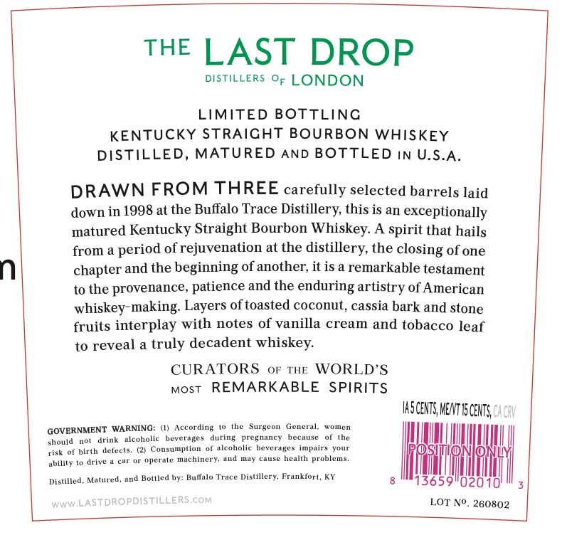
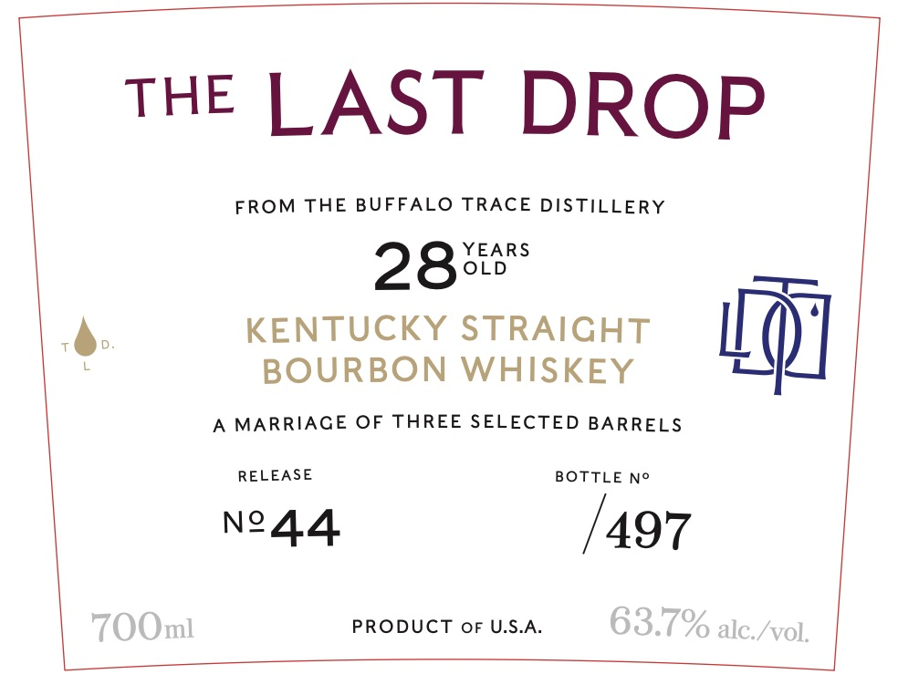

# TTB COLA Label Images - TTBID 26174001000256

**Brand Name:** THE LAST DROP

**Issue Date:** 06/29/2026

**Origin Code:** 22

**Product Class/Type:** 101

**Source:** [TTB Public COLA Registry](https://ttbonline.gov/colasonline/viewColaDetails.do?action=publicFormDisplay&ttbid=26174001000256)

## Label Images

### Back Label

### Front Label

## Extracted Label Text

*Text extracted via OCR - may contain errors*

**Detected Proof:** 127.4

### Back Label

THE
LAST DROP
DISTILLERS OF LONDON
LIMITED
BOTTLING
KENTUCKY STRAICHT BOURBON
WHISKEY
DISTILLED, MATURED
AND
BOTTLED IN U.S.A.
DRAWN FROM THREE carefully selected barrels laid
down in 1998 at the Buffalo Trace Distillery this is an exceptionally
matured Kentucky Straight Bourbon Whiskey. A spirit that hails
from a
of rejuvenation at the distillery, the
of one
n
chapter and the beginning of another; it is a remarkable testament
to the provenance; patience and the enduring artistry of American
whiskey-making: Layers oftoasted coconut, cassia bark and stone
fruits interplay with notes of vanilla cream and tobacco leaf
to reveal a truly decadent whiskey:
CURATORS
OF'
THE
WORLD'S
MOST
REMARKABLE
SPIRITS
IASCENTS MENT V5 CENTS CAGhV
GOVERNMENT WARNING:
According
the
Surgeon
General
womon
drink
acvholic
beveruges
during
EMADCY
bechusc
the
should
o[ birth deleets
Cunsumplion
alcoholic beverages
impairs
vour
0
risk
uperule machinery,
na
CmSC
health problems.
ability
drive
Mulured
Bottled by: Bullalo Trace Distillery, Frankfort, KY
Distilled_
13659102010
WWW LASTDROPDISTILLERS COM
LOT No. 280802
period
closing
MHd

### Front Label

THE LAST DROP
FROM THE BUFFALO
TRACE DISTILLERY
YEARS
28
OLD
KENTUCKY STRAICHT
BOURBON WHISKEY
MARRIACE OF THREE SELECTED BARRELS
RELEASE
BOTTLE No
Ne44
497
7OOml
PRODUCT OF U.S.A
63.7% alc /vol;
